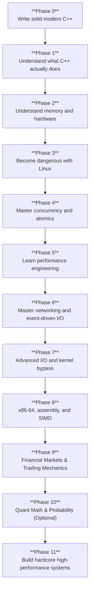
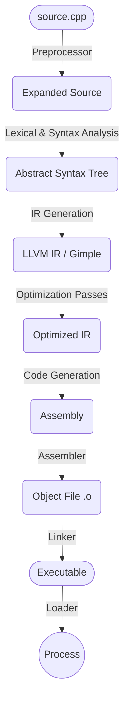
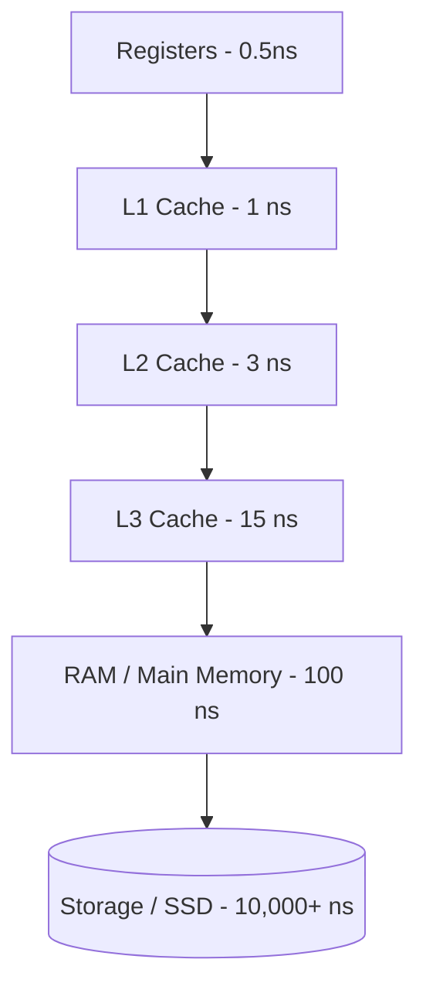
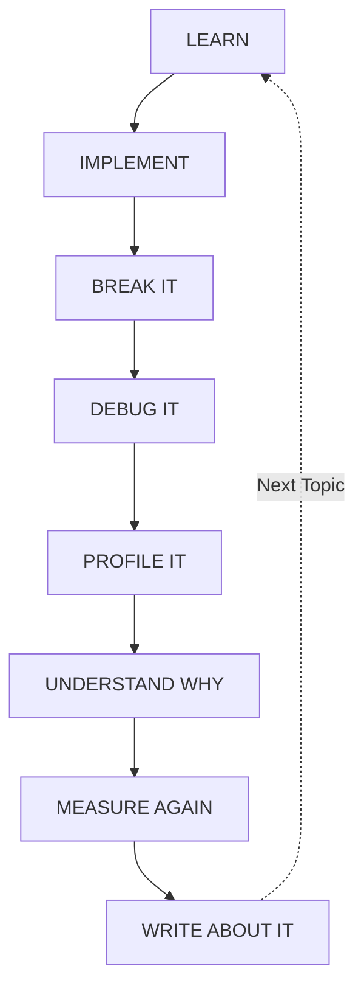

# C++ Systems & Performance Engineering Roadmap

> [!TIP]
> **Goal:** Become exceptionally strong in modern C++, Linux systems, concurrency, performance engineering, networking, and hardware-aware programming.

> [!NOTE]
> **Target profile:** HFT, low-latency systems, high-performance infrastructure, databases, runtimes, compilers, and strong systems/software roles at big tech.

---

## Roadmap Progression Tiers

| Tier | Candidate Profile & Core Competencies |
| :--- | :--- |
| **THE TOP 1% TIER** | **Lock-Free Primitives** • **Memory Consistency Models** • **Cache Coherence (MESI)** • **Micro-benchmarking** • **Assembly & Inlines** |
| **COMPETITIVE TIER** | Modern C++ (20/23) • Profiling (perf/VTune) • Kernel Bypass (DPDK/ef_vi) • Linux Kernel Tuning • Custom Allocators |
| **BASELINE TIER** | Standard DSA • Socket Programming • CMake • Valgrind • OOP |

### Role Track Specializations

| Role Track | What You Listed That Matters | Missing Essentials You Must Master |
| :--- | :--- | :--- |
| **C++ Core Software Dev (Low-Latency)** | Memory architecture (TLB, cache lines), `perf`, `Valgrind`, `VTune`, `CMake`, `DPDK`/`ef_vi` | **Extreme Concurrency:** Lock-free structures (SPSC, memory orders). **Modern C++ Internals:** Move semantics, `constexpr`/`consteval`, zero-cost abstractions. **OS & Architecture:** MESI, branch prediction, kernel bypass. **DSA:** Fast algorithmic reasoning under strict constraints. |
| **FPGA / Hardware Engineer** | FPGA (Verilog/VHDL, SystemVerilog), ITCH/OUCH parsing on chip, PCIe/Ethernet MAC layers | High-speed digital design, CDC (Clock Domain Crossing), pipeline timing closure, AXI stream interfaces, Vivado/Quartus toolchains. |
| **Quantitative Developer / Researcher** | Market mechanics (Order book matching, FIX, ITCH/OUCH) | Fast mental probability, linear algebra, time-series statistics, vectorized Python/C++ integration, pricing models. |

> [!TIP]
> **Key hiring reality for HFT freshers:** Most HFTs test Computer Architecture, Multithreading, Modern C++, and Advanced DSA/Puzzles during campus/off-campus hiring. You rarely get quizzed on proprietary APIs like `ef_vi` or ITCH/OUCH specifications in interviews, but knowing them makes your resume stand out and gives you an immediate advantage in technical discussions and trial weeks.

# Table of Contents

1. [The Overall Roadmap](#1-the-overall-roadmap)
2. [Phase 0 — Modern C++ Foundation](#2-phase-0--modern-c-foundation)
3. [Phase 1 — What Happens Beneath C++ & Compiler Design](#3-phase-1--what-happens-beneath-c--compiler-design)
4. [Phase 2 — CPU Architecture, Memory, and Hardware](#4-phase-2--cpu-architecture-memory-and-hardware)
5. [Phase 3 — OS Fundamentals & Linux Systems Mastery](#5-phase-3--os-fundamentals--linux-systems-mastery)
6. [Phase 4 — Concurrency & Memory Models](#6-phase-4--concurrency--memory-models)
7. [Phase 5 — Performance Engineering](#7-phase-5--performance-engineering)
8. [Phase 6 — Networking and I/O](#8-phase-6--networking-and-io)
9. [Phase 7 — Advanced I/O and Kernel Bypass](#9-phase-7--advanced-io-and-kernel-bypass)
10. [Phase 8 — x86-64, Assembly, and SIMD](#10-phase-8--x86-64-assembly-and-simd)
11. [Phase 9 — Financial Markets & Trading Mechanics](#11-phase-9--financial-markets--trading-mechanics)
12. [Phase 10 — Quantitative Math & Probability (Quant Track)](#12-phase-10--quantitative-math--probability-quant-track)
13. [Phase 11 — The Hardcore Flagship Projects](#13-phase-11--the-hardcore-flagship-projects)
14. [What Not to Learn Yet](#14-what-not-to-learn-yet)
15. [Weekly Study Split](#15-weekly-study-split)
16. [Free Resources](#16-free-resources)
17. [The Learning Loop](#17-the-learning-loop)

---

# 1. The Overall Roadmap

> [!IMPORTANT]
> Do not try to learn all of this simultaneously. Depth matters more than touching everything once.

The goal is to become someone who can answer:
- What does this code compile into?
- Where is this object stored?
- Who owns this memory?
- What is its lifetime?
- How does this affect the cache?
- Is this operation thread-safe?
- What does the compiler optimize?
- Where is the actual bottleneck?

---

# 2. Phase 0 — Modern C++ Foundation

**Estimated time: 2–4 months**

### 📚 Useful References for Phase 0
- [cppreference: C++ Language](https://en.cppreference.com/w/cpp/language)
- [Learn C++ (Comprehensive tutorials)](https://www.learncpp.com/)
- [Effective Modern C++ by Scott Meyers](https://www.oreilly.com/library/view/effective-modern-c/9781491908419/)
- [YouTube: CppCon - Back to Basics Series](https://www.youtube.com/playlist?list=PLHTh1InhhwT6vqw21c_QhE6cZ75FkQst_)

## Core Language

- **Pointers and references** [Docs](https://en.cppreference.com/w/cpp/language/pointer)
  - The mechanisms for indirect memory access. References are essentially syntax sugar for non-null, immutable pointers.
- **Object lifetime & Storage duration** [Docs](https://en.cppreference.com/w/cpp/language/lifetime)
  - Understanding when an object is created and destroyed (automatic/stack, dynamic/heap, static, thread-local).
- **Stack vs heap** [Resource](https://www.learncpp.com/cpp-tutorial/the-stack-and-the-heap/)
  - Stack is fast, local, and auto-managed. Heap is slow, global, and requires explicit OS memory allocation.
- **`const` correctness** [Docs](https://isocpp.org/wiki/faq/const-correctness)
  - Enforcing immutability at compile-time to prevent state changes and enable optimizations.
- **Value categories (Lvalues, Xvalues, Prvalues)** [Docs](https://en.cppreference.com/w/cpp/language/value_category)
  - Understanding expressions you can assign to (lvalues) vs temporaries (rvalues). This is the foundation of move semantics.
- **Copy vs Move semantics** [Docs](https://en.cppreference.com/w/cpp/utility/move)
  - Copying duplicates data. Move semantics (`std::move`) steals resources from temporary objects for zero-cost transfers.
- **Constructors and destructors** [Docs](https://en.cppreference.com/w/cpp/language/constructor)
  - Hooking into the lifecycle of an object for resource initialization and cleanup.
- **RAII (Resource Acquisition Is Initialization)** [Resource](https://en.cppreference.com/w/cpp/language/raii)
  - Tying resource lifecycle (memory, file handles, locks) to object lifetime to guarantee exception-safe cleanup.
- **Exceptions & `std::expected` (C++23)** [Docs](https://en.cppreference.com/w/cpp/utility/expected)
  - Understand the massive cost of stack unwinding and why HFT environments compile with `-fno-exceptions`. Learn modern exception-less error handling using `std::expected` (monadic error handling).
- **Templates & Concepts (C++20)** [Docs](https://en.cppreference.com/w/cpp/language/templates)
  - Compile-time polymorphism. Concepts constrain templates for better error messages.
- **Lambdas** [Docs](https://en.cppreference.com/w/cpp/language/lambda)
  - Anonymous inline functions. Understand how variable capture (`=` vs `&`) translates to internal state.
- **`constexpr` & `consteval` (C++20)** [Docs](https://en.cppreference.com/w/cpp/language/constexpr)
  - Forcing computation to happen at compile-time, resulting in zero runtime cost.

## Modern Standard Library

- **Containers:**
  - `std::vector` (contiguous memory, cache-friendly) [Docs](https://en.cppreference.com/w/cpp/container/vector)
  - `std::array` (stack-allocated) [Docs](https://en.cppreference.com/w/cpp/container/array)
  - `std::deque` (chunked contiguous) [Docs](https://en.cppreference.com/w/cpp/container/deque)
  - `std::unordered_map` (hash table) [Docs](https://en.cppreference.com/w/cpp/container/unordered_map)
- **Smart Pointers:**
  - `std::unique_ptr` (exclusive ownership) [Docs](https://en.cppreference.com/w/cpp/memory/unique_ptr)
  - `std::shared_ptr` (shared ownership, atomic reference counting) [Docs](https://en.cppreference.com/w/cpp/memory/shared_ptr)
  - *Note: High-performance code often entirely avoids `std::shared_ptr` due to this atomic overhead, favoring deterministic lifetime design with raw non-owning pointers.*
- **Vocabulary Types:**
  - `std::optional` (might not contain a value) [Docs](https://en.cppreference.com/w/cpp/utility/optional)
  - `std::variant` (type-safe union) [Docs](https://en.cppreference.com/w/cpp/utility/variant)
  - `std::span` (non-owning view of contiguous memory) [Docs](https://en.cppreference.com/w/cpp/container/span)
  - `std::string_view` [Docs](https://en.cppreference.com/w/cpp/string/basic_string_view)
- **Algorithms & Ranges:**
  - `std::algorithm` (sort, find) [Docs](https://en.cppreference.com/w/cpp/algorithm)
  - `std::ranges` (C++20 functional chaining) [Docs](https://en.cppreference.com/w/cpp/ranges)

---

# 3. Phase 1 — What Happens Beneath C++ & Compiler Design

### 📚 Useful References for Phase 1
- [Compiler Explorer (Godbolt)](https://godbolt.org/)
- [GCC and Make - A Tutorial](https://www3.ntu.edu.sg/home/ehchua/programming/cpp/gcc_make.html)
- [How to Write a Shared Library (Ulrich Drepper)](https://akkadia.org/drepper/dsohowto.pdf)
- [CMake Official Documentation](https://cmake.org/cmake/help/latest/)

## The Compilation Pipeline & Compiler Design

- **Translation units** [Docs](https://en.cppreference.com/w/cpp/language/translation_phases)
  - A single `.cpp` file after the preprocessor has run. The compiler compiles each completely independently.
- **Headers & Include guards** [Docs](https://en.cppreference.com/w/c/preprocessor/include)
  - Headers declare interfaces. Guards prevent a header from being copied into a translation unit multiple times.
- **The One Definition Rule (ODR)** [Docs](https://en.cppreference.com/w/cpp/language/odr)
  - You can declare a symbol many times, but define it exactly once. Violating this causes linker errors or Undefined Behavior.
- **Name mangling** [Resource](https://en.wikipedia.org/wiki/Name_mangling)
  - Because C++ supports function overloading, the compiler mangles names (e.g., `void foo(int)` becomes `_Z3fooi`) so the linker can identify them.
- **Object Files (.o) & ELF** [Resource](https://en.wikipedia.org/wiki/Executable_and_Linkable_Format)
  - The binary format of compiled code containing machine instructions and symbol tables. ELF is the standard on Linux.
- **Symbol resolution** [Resource](https://ftp.gnu.org/old-gnu/Manuals/ld-2.9.1/html_chapter/ld_3.html)
  - How the linker matches a function call in one object file to its definition in another.
- **Static Linking** [Resource](https://en.wikipedia.org/wiki/Static_library)
  - Copies library code directly into your executable (`.a` files), making it larger but slightly faster.
- **Dynamic Linking** [Resource](https://en.wikipedia.org/wiki/Dynamic_linker)
  - Resolves library code at runtime (`.so` files). Introduces a tiny overhead via the PLT/GOT.
- **ABI (Application Binary Interface)** [Resource](https://en.wikipedia.org/wiki/Application_binary_interface)
  - The low-level standard detailing how functions are called, how structs are laid out, and register usage.
- **Compiler Design Basics:**
  - *Frontend:* Tokenizes code into an Abstract Syntax Tree (AST).
  - *Middle-end:* Translates AST into Intermediate Representation (IR, like LLVM IR) and runs optimization passes.
  - *Backend:* Emits target-specific assembly for x86-64 or ARM.
- **LTO (Link-Time Optimization) & PGO (Profile-Guided Optimization)** [Docs (GCC)](https://gcc.gnu.org/onlinedocs/gcc/Optimize-Options.html)
  - LTO inlines functions across different translation units. PGO uses actual profiling data to optimize hot paths.

---

# 4. Phase 2 — CPU Architecture, Memory, and Hardware

### 📚 Useful References for Phase 2
- [What Every Programmer Should Know About Memory](https://people.freebsd.org/~lstewart/articles/cpumemory.pdf)
- [Data-Oriented Design (Richard Fabian)](https://www.dataorienteddesign.com/dodbook/)
- [YouTube: Scott Meyers - Cpu Caches and Why You Care](https://www.youtube.com/watch?v=WDIkqP4JbkE)

## Learn the Memory Hierarchy

- **Cache Lines (64 Bytes)** [Resource](https://en.wikipedia.org/wiki/CPU_cache#Cache_lines)
  - The CPU fetches 64-byte chunks from RAM, not single bytes. Data structures fitting in cache lines are exponentially faster.
- **Spatial & Temporal Locality** [Resource](https://en.wikipedia.org/wiki/Locality_of_reference)
  - *Spatial:* Accessing address X means X+1 is likely next. This predictable access triggers the **Hardware Prefetcher**, pulling the next cache line into the CPU early.
  - *Temporal:* Accessing address X means X will be accessed again soon.
- **TLB (Translation Lookaside Buffer) & Paging** [Resource](https://en.wikipedia.org/wiki/Translation_lookaside_buffer)
  - The TLB caches virtual-to-physical address translations. If the TLB misses, the CPU must do a slow "page walk".
- **HugePages (2MB / 1GB)** [Docs (Linux)](https://www.kernel.org/doc/html/latest/admin-guide/mm/hugetlbpage.html)
  - Standard pages are 4KB. HugePages reduce TLB misses drastically because fewer pages cover the same memory.

## Advanced Hardware Microarchitecture

- **Cache Coherence & MESI/MOESI Protocol** [Resource](https://en.wikipedia.org/wiki/MESI_protocol)
  - In multi-core CPUs, MESI tracks cache states (Modified, Exclusive, Shared, Invalid) to ensure consistency when multiple cores access the same RAM.
- **Store Buffers & Invalidation Queues** [Resource](https://en.wikipedia.org/wiki/Store_buffer)
  - Writes go to a store buffer before hitting cache, necessitating memory barriers to ensure threads see writes in order.
- **False Sharing** [Resource](https://en.wikipedia.org/wiki/False_sharing)
  - If two threads modify independent variables that reside on the *same cache line*, the CPU bounces the cache line back and forth, crushing performance. Solved via `alignas(64)`.
- **Branch Prediction Internals** [Resource](https://en.wikipedia.org/wiki/Branch_predictor)
  - The CPU guesses if an `if` statement is true (Speculative Execution) via the BTB (Branch Target Buffer). A misprediction costs ~20 cycles. Hinting with `[[likely]]` / `[[unlikely]]` favors the hot path.
- **NUMA (Non-Uniform Memory Access)** [Resource](https://en.wikipedia.org/wiki/Non-uniform_memory_access)
  - On multi-socket motherboards, a CPU accesses its local RAM fast, but RAM on the other socket is slow. Solved by `pthread_setaffinity_np` and `libnuma`.

---

# 5. Phase 3 — OS Fundamentals & Linux Systems Mastery

### 📚 Useful References for Phase 3
- [The Linux Programming Interface](https://man7.org/tlpi/)
- [Beej's Guide to Unix Interprocess Communication](https://beej.us/guide/bgipc/)
- [YouTube: Linux OS Internals for C++ Developers](https://www.youtube.com/watch?v=0iWb_qi2-uI)

## OS Fundamentals

- **Process vs Thread** [Resource](https://en.wikipedia.org/wiki/Thread_(computing))
  - A process provides an isolated virtual memory space. Threads share that space but have their own stack and registers.
- **Context Switches** [Resource](https://en.wikipedia.org/wiki/Context_switch)
  - The heavy cost of the OS swapping a thread out of a CPU core. It flushes registers and pollutes the L1/L2 caches.
- **System Calls** [Docs (Linux)](https://man7.org/linux/man-pages/man2/syscall.2.html)
  - The boundary between User Space and Kernel Space. Syscalls (`read`, `malloc` via `mmap`) are slow due to context switching.
- **File Descriptors** [Resource](https://en.wikipedia.org/wiki/File_descriptor)
  - In Linux, everything (sockets, pipes, files) is interacted with via integer File Descriptors.
- **Memory-Mapped Files (`mmap`)** [Docs (Linux)](https://man7.org/linux/man-pages/man2/mmap.2.html)
  - Mapping a file directly into RAM. Heavily used in HFT for ultra-fast IPC and zero-copy logging.
- **Signals** [Docs (Linux)](https://man7.org/linux/man-pages/man7/signal.7.html)
  - Asynchronous interrupts (e.g., `SIGINT`, `SIGSEGV`).

## Advanced Low-Latency Linux Tuning

- **Kernel Core Isolation** [Docs (Linux)](https://www.kernel.org/doc/html/latest/admin-guide/kernel-parameters.html)
  - Reserving CPU cores so the Linux Scheduler NEVER touches them using boot parameters like `isolcpus`, `nohz_full`, and `rcu_nocbs`.
- **System Jitter & Power States** [Resource](https://access.redhat.com/documentation/en-us/red_hat_enterprise_linux/7/html/power_management_guide/cpufreq_governors)
  - Disabling CPU frequency scaling and locking CPU C-states (`intel_idle.max_cstate=0`) to ensure deterministic execution times.
- **Memory Locking (`mlockall`)** [Docs (Linux)](https://man7.org/linux/man-pages/man2/mlock.2.html)
  - Locking your app into physical RAM to entirely prevent the OS from swapping it to disk.

---

# 6. Phase 4 — Concurrency & Memory Models

### 📚 Useful References for Phase 4
- [C++ Concurrency in Action (Anthony Williams)](https://www.manning.com/books/c-plus-plus-concurrency-in-action-second-edition)
- [cppreference: std::memory_order](https://en.cppreference.com/w/cpp/atomic/memory_order)
- [YouTube: Fedor Pikus "The C++ Memory Model"](https://www.youtube.com/watch?v=F6Ipn7gCOsY)

## Level 1 — Basic Threading

- **Mutexes & Critical Sections** [Docs](https://en.cppreference.com/w/cpp/thread/mutex)
  - `std::mutex` puts a waiting thread to sleep (context switch).
- **Spinlocks vs Mutexes** [Resource](https://en.wikipedia.org/wiki/Spinlock)
  - Because sleeping costs microseconds, low-latency systems use Spinlocks (`while(atomic_flag.test_and_set())`). It burns 100% CPU but reacts in nanoseconds.
- **Deadlocks** [Resource](https://en.wikipedia.org/wiki/Deadlock)
  - Thread A holds Lock 1 and wants Lock 2; Thread B holds Lock 2 and wants Lock 1. Both freeze forever.

## Level 2 — Atomics & The C++ Memory Model

- **`std::atomic`** [Docs](https://en.cppreference.com/w/cpp/atomic/atomic)
  - Hardware atomics bypass the OS entirely for Lock-Free programming.
- **`std::memory_order_relaxed`** [Docs](https://en.cppreference.com/w/cpp/atomic/memory_order#Relaxed_ordering)
  - Atomicity guaranteed, but no synchronization. The compiler and CPU can reorder instructions freely around this.
- **`std::memory_order_acquire` / `release`** [Docs](https://en.cppreference.com/w/cpp/atomic/memory_order#Release-Acquire_ordering)
  - A `release` store ensures all previous writes are visible. An `acquire` load ensures no subsequent reads/writes are reordered before it.
- **`std::memory_order_seq_cst`** [Docs](https://en.cppreference.com/w/cpp/atomic/memory_order#Sequentially-consistent_ordering)
  - Sequential consistency (safest but slowest). Adds heavy memory fences (like `mfence`) to force a global total order.

## Level 3 — Concurrency Problems

- **Data Races vs Race Conditions** [Resource](https://en.wikipedia.org/wiki/Race_condition)
  - Data race = simultaneous unsynchronized memory writes (Undefined Behavior). Race condition = flawed logic depending on execution order.
- **ABA Problem** [Resource](https://en.wikipedia.org/wiki/ABA_problem)
  - Thread 1 reads A. Thread 2 changes A to B, then back to A. Thread 1 resumes and mistakenly thinks nothing changed, corrupting lock-free structures.
- **Safe Memory Reclamation (SMR)** [Resource](https://en.wikipedia.org/wiki/Hazard_pointer)
  - In lock-free structures, you can't just `delete` a node because another thread might be reading it. You use Hazard Pointers or Epoch-Based Reclamation (EBR).
- **Hardware vs Software Reordering** [Docs (GCC)](https://gcc.gnu.org/onlinedocs/gcc/Extended-Asm.html)
  - The compiler can optimize assembly (`asm volatile("" ::: "memory")`). The CPU can execute out of order (prevented by hardware fences like `lfence`).

---

# 7. Phase 5 — Performance Engineering & Reliability

### 📚 Useful References for Phase 5
- [Systems Performance (Brendan Gregg)](https://www.brendangregg.com/systems-performance.html)
- [Google Benchmark Documentation](https://github.com/google/benchmark)
- [YouTube: Chandler Carruth "Efficiency with Algorithms"](https://www.youtube.com/watch?v=fHNmRkzxHWs)

## Profiling Tools

- **`perf`** [Docs](https://perf.wiki.kernel.org/index.php/Main_Page)
  - The Linux standard for sampling CPU cycles, branch misses, and cache misses.
- **Flamegraphs** [Resource](https://www.brendangregg.com/flamegraphs.html)
  - The industry standard visualization for `perf`. Highlights wide stack traces eating up CPU time.
- **Intel `VTune`** [Docs](https://www.intel.com/content/www/us/en/developer/tools/oneapi/vtune-profiler.html)
  - Deep microarchitecture profiling (IPC, cache hit rates, memory bandwidth).
- **`Valgrind`** [Docs](https://valgrind.org/docs/manual/manual.html)
  - Detects memory leaks and Uninitialized memory reads (though it drastically slows down execution).
- **`heaptrack`** [Docs](https://github.com/KDE/heaptrack)
  - Fast memory allocation profiling to track down exact lines of code doing hidden `malloc`s.

## Low-Latency Benchmarking Rigor

- **Hardware Cycle Counting** [Resource](https://en.wikipedia.org/wiki/Time_Stamp_Counter)
  - Use raw hardware cycle counters (`__rdtsc()`). Must bracket code with serialization barriers (`cpuid` / `lfence`) to prevent out-of-order timer execution.
- **Coordinated Omission** [Resource](https://psy-lob-saw.blogspot.com/2015/03/coordinated-omission.html)
  - A benchmarking trap where a system under load queues measurements, falsely hiding latency spikes.
- **Percentile Profiling** [Resource](https://www.p99conf.io/)
  - Averages hide latency spikes. You must optimize for the "Tail Latency" — the 99.9th percentile (p99.9) and Max latency.

## Testing, Debugging & Reliability

In HFT, performance without correctness is bankruptcy (e.g., the Knight Capital $460M glitch).
- **Time-Travel Debugging (`rr`)** [Docs](https://rr-project.org/)
  - Standard `gdb` is great for core dumps, but `rr` (Record and Replay) allows you to record an execution and step *backwards* in time to find the exact origin of non-deterministic multithreading bugs.
- **Fuzzing (`libFuzzer`)** [Docs](https://llvm.org/docs/LibFuzzer.html)
  - Feeding random, mutated, garbage network packets into your ITCH/FIX parsers to ensure they never segfault or buffer-overflow in production.
- **Core Dump Analysis** [Resource](https://man7.org/linux/man-pages/man5/core.5.html)
  - Being able to take a production crash (`SIGSEGV`), load the `core` file into `gdb`, and inspect the exact CPU registers and stack frames that caused the crash.

---

# 8. Phase 6 — Networking and I/O

### 📚 Useful References for Phase 6
- [Beej's Guide to Network Programming](https://beej.us/guide/bgnet/)
- [High Performance Browser Networking](https://hpbn.co/)

## Network Architecture

- **TCP (Transmission Control Protocol)** [Resource](https://en.wikipedia.org/wiki/Transmission_Control_Protocol)
  - Reliable, ordered. Understand the 3-way handshake and Nagle's algorithm (which batches packets and must be disabled via `TCP_NODELAY` for low latency).
- **UDP (User Datagram Protocol)** [Resource](https://en.wikipedia.org/wiki/User_Datagram_Protocol)
  - Unreliable, unordered datagrams. Faster than TCP because there is no handshake or ACK overhead.
- **User-Space Event Polling (`epoll`)** [Docs (Linux)](https://man7.org/linux/man-pages/man7/epoll.7.html)
  - Monitor thousands of sockets asynchronously. In ultra-low latency, you skip `epoll` entirely and use busy-polling/busy-wait loops to avoid context switches.

---

# 9. Phase 7 — Advanced I/O and Kernel Bypass

### 📚 Useful References for Phase 7
- [Lord of the io_uring (Axboe)](https://unixism.net/loti/)
- [DPDK Official Documentation](https://doc.dpdk.org/guides/)
- [OpenOnload Documentation](https://www.xilinx.com/products/design-tools/onload.html)

## Kernel Bypass Tech

- **`ef_vi` & DMA (Direct Memory Access)** [Docs (Solarflare)](https://support.xilinx.com/s/article/1118676?language=en_US)
  - `ef_vi` allows C++ to read packets directly from the NIC's buffer (zero-copy). It works because the NIC uses DMA to write packets directly to RAM over the PCIe bus without waking up the CPU, skipping the Linux network stack.
- **`OpenOnload`** [Docs](https://github.com/Xilinx-CNS/onload)
  - Transparent kernel bypass. You launch your app with `LD_PRELOAD`, intercepting POSIX socket calls (`recv`, `send`) and translating them into bypass calls.
- **DPDK (Data Plane Development Kit)** [Docs](https://www.dpdk.org/)
  - Framework for fast packet processing.
- **Poll-Mode Drivers** [Resource](https://doc.dpdk.org/guides/prog_guide/poll_mode_drv.html)
  - Instead of hardware interrupts, your CPU spins in a `while` loop asking the NIC for data (100% CPU usage, zero latency).
- **Zero-Allocation Pipelines**
  - Pre-allocating 100% of memory on startup via Arena Allocators and Object Pools using HugePages. Dynamic allocation at runtime is forbidden.

---

# 10. Phase 8 — x86-64, Assembly, and SIMD

### 📚 Useful References for Phase 8
- [Intel 64 Architectures Software Developer Manuals](https://software.intel.com/content/www/us/en/develop/articles/intel-sdm.html)
- [Compiler Explorer (Godbolt)](https://godbolt.org/)

## CPU Execution

- **Registers & Calling Conventions** [Resource](https://en.wikipedia.org/wiki/X86_calling_conventions)
  - Fast on-CPU memory slots (`rax`, `rdi`). Understand the System V ABI for how parameters are passed.
- **Instruction-Level Parallelism (ILP)** [Resource](https://en.wikipedia.org/wiki/Instruction-level_parallelism)
  - CPUs execute multiple instructions simultaneously using a Reorder Buffer (ROB) and Out-of-Order (OoO) execution to find independent instructions.
- **SIMD (Single Instruction, Multiple Data)** [Resource](https://en.wikipedia.org/wiki/SIMD)
  - `AVX2`, `AVX-512`. Hardware vectorization executing the same operation on an entire array in a single cycle.
- **Compiler Intrinsics** [Docs (Intel)](https://www.intel.com/content/www/us/en/docs/intrinsics-guide/index.html)
  - Writing C++ functions (e.g., `_mm256_load_si256`) that map directly to specific SIMD assembly instructions, bypassing the auto-vectorizer's guessing game.

---

# 11. Phase 9 — Financial Markets & Trading Mechanics

### 📚 Useful References for Phase 9
- [Trading & Exchanges (Larry Harris)](https://www.amazon.com/Trading-Exchanges-Market-Microstructure-Practitioners/dp/0195144708)
- [Investopedia: Algorithmic Trading](https://www.investopedia.com/articles/active-trading/101014/basics-algorithmic-trading-concepts-and-examples.asp)
- [FIX Protocol Documentation](https://www.fixtrading.org/what-is-fix/)

## Market Fundamentals

- **Bid / Ask & The Spread** [Resource](https://www.investopedia.com/terms/b/bid-and-ask.asp)
  - "Bid" = highest price a buyer pays. "Ask" = lowest price a seller accepts. Spread = the difference.
- **Limit Order Book (LOB)** [Resource](https://www.investopedia.com/terms/l/limitorderbook.asp)
  - The core data structure of an exchange. Holds all resting orders sorted by Price-Time Priority.
- **Limit vs Market Orders** [Resource](https://www.investopedia.com/terms/m/marketorder.asp)
  - Limit Order specifies an exact price (adds liquidity). Market Order executes immediately at the best price (takes liquidity).
- **ITCH / OUCH / FIX Protocols**
  - *ITCH:* Multicast binary feed broadcasting every order book change. [Docs](http://www.nasdaqtrader.com/content/technicalsupport/specifications/dataproducts/NQTVITCHspecification.pdf)
  - *OUCH:* Point-to-point binary protocol to send orders.
  - *FIX:* A slower, human-readable ASCII string protocol used for standard order routing.

## Trading Strategies

- **Market Making** [Resource](https://www.investopedia.com/terms/m/marketmaker.asp)
  - Quoting Bid and Ask limit orders to profit from the Spread. The risk is "Adverse Selection" (the market violently moves against you). Speed is required to cancel orders before being "run over".
- **Statistical Arbitrage (Stat Arb)** [Resource](https://www.investopedia.com/terms/s/statisticalarbitrage.asp)
  - Mathematical models identifying temporary pricing inefficiencies between correlated assets (e.g., mean reversion pairs trading).
- **Smart Order Routing (SOR)** [Resource](https://www.investopedia.com/terms/s/smart-order-routing.asp)
  - Algorithms that break up a massive order and route slices to different fragmented exchanges to sweep liquidity and minimize market impact.
- **Execution Algos (TWAP/VWAP)** [Resource](https://www.investopedia.com/terms/v/vwap.asp)
  - Institutional algos designed to trade huge volumes over time (Time-Weighted) or based on volume (Volume-Weighted) without crashing the market.

---

# 12. Phase 10 — Quantitative Math & Probability (Quant Track)

If you are aiming for **Quantitative Developer** or **Quantitative Researcher** roles, pure C++ systems knowledge is not enough. You must understand the math that drives the trading models.

### 📚 Useful References for Phase 10
- [MIT 18.06: Linear Algebra (Gilbert Strang)](https://ocw.mit.edu/courses/18-06-linear-algebra-spring-2010/video_galleries/video-lectures/)
- [Harvard Stat 110: Probability (Joe Blitzstein)](https://www.youtube.com/playlist?list=PL2SOU6wwxB0uwwH80KTQ6ht66KWxbzTIo)
- [MIT 18.S096: Math with Applications in Finance](https://ocw.mit.edu/courses/18-s096-topics-in-mathematics-with-applications-in-finance-fall-2013/video_galleries/video-lectures/)

## Core Mathematics

- **Linear Algebra** [Resource](https://ocw.mit.edu/courses/18-06-linear-algebra-spring-2010/)
  - The foundation of modern quant finance. You must deeply understand Matrix Multiplication, Eigenvalues/Eigenvectors, and Singular Value Decomposition (SVD). Used heavily in portfolio optimization and risk factor modeling.
- **Probability & Statistics** [Resource](https://statistics.fas.harvard.edu/pages/stat-110)
  - Bayes' Theorem, Random Variables, Expected Value, and Probability Distributions (Normal, Poisson, Log-Normal). You must be able to do fast mental probability calculations for Quant interviews.
- **Time-Series Analysis** [Resource](https://www.itl.nist.gov/div898/handbook/pmc/section4/pmc4.htm)
  - Autocorrelation, Stationarity, and Cointegration. Used to analyze historical market tick data to find mean-reverting signals.
- **Stochastic Calculus (Advanced/Optional)** [Resource](https://en.wikipedia.org/wiki/Stochastic_calculus)
  - Brownian motion, Ito's Lemma, and the Black-Scholes model. Only strictly necessary for options pricing and derivatives research, but highly respected.

---

# 13. Phase 11 — The Hardcore Flagship Projects

To stand out against candidates from MIT/Stanford, you cannot just build a "To-Do App" or a basic web scraper. You must build extremely hardcore, specialized infrastructure that proves your mechanical empathy for the hardware.

### 📚 Useful References for Phase 11
- [Adaptive: Building a High-Performance Matching Engine](https://weareadaptive.com/2021/08/23/build-high-performance-matching-engine/)
- [LMAX Architecture (Martin Fowler)](https://martinfowler.com/articles/lmax.html)
- [YouTube: Carl Cook "When a Microsecond Is an Eternity"](https://www.youtube.com/watch?v=NH1Tta7purM)

## 1. Ultra-Low-Latency Limit Order Book (LOB) & Matching Engine
- **Description:** A core exchange matching engine processing incoming limit, market, and cancel orders using Price-Time priority. This is the ultimate test of data-oriented design.
- **Architecture Constraints:** 
  - **Zero dynamic allocations (`new`/`malloc`)** in the hot path. All memory must be pre-allocated on startup.
  - Use **Flat Arrays** for price levels and **Custom Object Pools** for order nodes to guarantee L1/L2 cache locality.
  - Strictly avoid `virtual` functions to prevent vtable indirection/branch misprediction.
- **Testing & Profiling:** Bracket your core matching function with `__rdtsc()` (Hardware cycle counters). Profile with `perf stat` and generate Flamegraphs.
- **Success Metric:** Achieve sub-100 nanosecond tick-to-trade latency at the 99th percentile (p99).

## 2. Kernel-Bypass Hardware-Accurate ITCH 5.0 Feed Handler
- **Description:** A market data parser that connects to a UDP multicast socket, reads raw network packets, and reconstructs the NASDAQ order book in real-time.
- **Architecture Constraints:**
  - Start with `epoll`, upgrade to a **busy-wait polling loop**, and finally implement a **Kernel Bypass** version using Solarflare `ef_vi` or `OpenOnload`.
  - Implement a **Zero-Copy Architecture**: parse the packet directly from the NIC's receive buffer.
  - Use **Compiler Intrinsics** (`__builtin_bswap32/64`) to handle network byte-order endianness instantly, and SIMD instructions to bulk-decode ASCII message types.
- **Success Metric:** Process over 1 million market messages per second with zero garbage collection spikes.

## 3. High-Throughput Lock-Free SPSC / MPMC Ring Buffer
- **Description:** A custom concurrent queue designed to pass market data from a network thread to a strategy thread without ever asking the OS for a lock.
- **Architecture Constraints:**
  - Must utilize explicit `std::memory_order_acquire` and `std::memory_order_release` semantics to synchronize threads.
  - Cache-line align (`alignas(64)`) the head and tail atomic pointers to completely eliminate **False Sharing** between the producer and consumer CPU cores.
- **Success Metric:** Write a Google Benchmark proving your queue outperforms `std::mutex` + `std::condition_variable` queues by at least an order of magnitude.

## 4. Custom C++ Arena Allocator & Memory Pool Library
- **Description:** In HFT, `malloc` is banned because the OS locks the heap and takes microseconds to find free memory. You will write your own ultra-fast memory manager.
- **Architecture Constraints:**
  - Implement a **Monotonic Arena Allocator** (bump allocator) for per-tick temporary data that gets reset at the end of every event loop.
  - Implement a **Free-List Object Pool** for objects that live longer (like active network connections or resting orders).
  - Use `madvise` or `mmap` to request **HugePages (2MB)** directly from the Linux Kernel on startup to prevent TLB misses.
- **Success Metric:** Prove via microbenchmarks that your allocator is 10x-50x faster than standard `std::allocator`.

---

# 14. What Not to Learn Yet

- **Do Not Memorize Every C++ Feature:** You don't need every obscure template trick or Boost library. Understand deeply instead.
- **Do Not Learn Design Patterns as a Checklist:** Understand *why* an abstraction exists and its *runtime cost*. Indirection (like heavy OOP/virtual functions) destroys cache locality. Choose abstractions based on the hardware problem.
- **Do Not Start With Lock-Free Programming:** Master mutexes, cache coherence, and contention before writing the world's fastest lock-free structures.
- **Do Not Spend All Your Time on LeetCode:** Maintain strong DSA skills, but pair them with serious systems knowledge and projects.

---

# 15. Weekly Study Split

A good approximate split for mastering this domain:
- **35% — C++ + Systems Projects:** Actual implementation. Build things.
- **25% — DSA / Competitive Programming:** Maintain algorithmic strength.
- **20% — Systems Theory:** Study OS, Networking, Architecture, Concurrency.
- **15% — Performance Engineering:** Benchmarking, Profiling, Assembly.
- **5% — Reading Excellent Code:** Read Linux kernel components, high-perf libraries, DBs.

---

# 16. Free Resources

- **[cppreference.com](https://en.cppreference.com/)** - Your permanent C++ reference.
- **[CppCon YouTube Channel](https://www.youtube.com/@CppCon)** - Watch speakers like Chandler Carruth, Fedor Pikus, Carl Cook, Timur Doumler.
- **[Compiler Explorer (godbolt.org)](https://godbolt.org/)** - For assembly inspection.
- **[Agner Fog's Optimization Manuals](https://www.agner.org/optimize/)** - The bible for x86 microarchitecture.

---

# 17. The Learning Loop

For every project, your README should answer:
1. What problem does this solve?
2. What is the architecture?
3. What tradeoffs did you make?
4. How did you measure performance?
5. What bottleneck did you find?
6. What optimization did you make?
7. Why did it work?

---

# Final Goal

Do not aim to become:
> Someone who knows a lot of C++ syntax.

Aim to become:
> [!SUCCESS]
> **Someone who can understand a system from the C++ source code down through assembly, CPU behavior, memory, Linux, networking, and performance measurements.**

That is the kind of depth that makes you genuinely exceptional. Go deep, build continuously, benchmark everything, and document your work.
