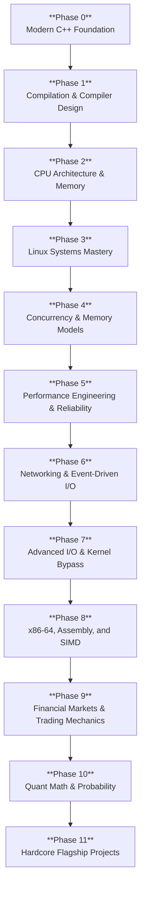
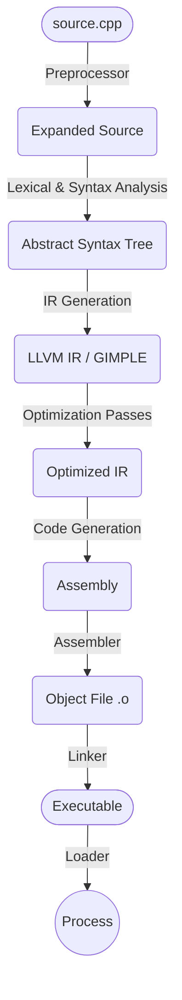
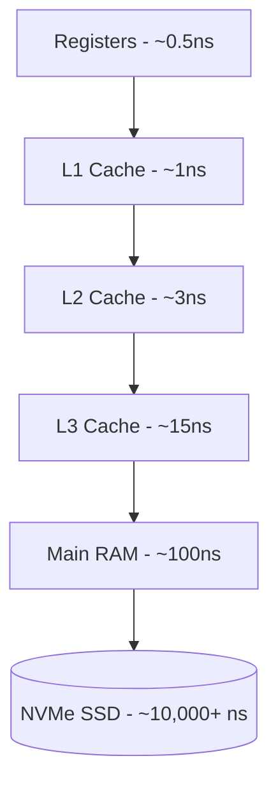
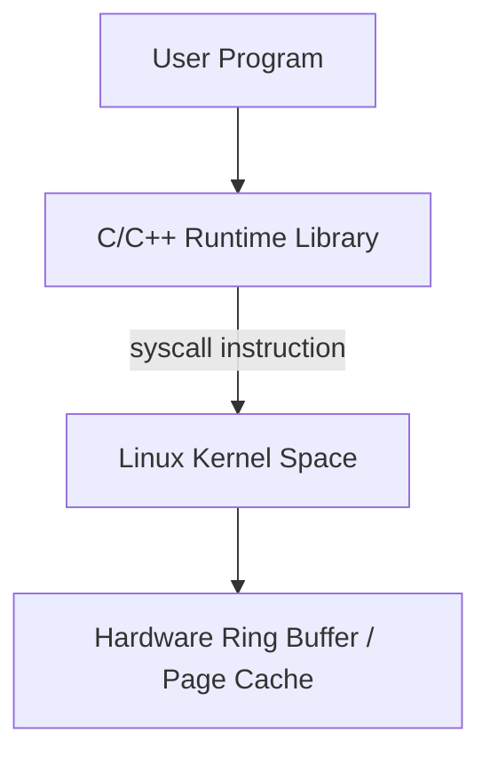
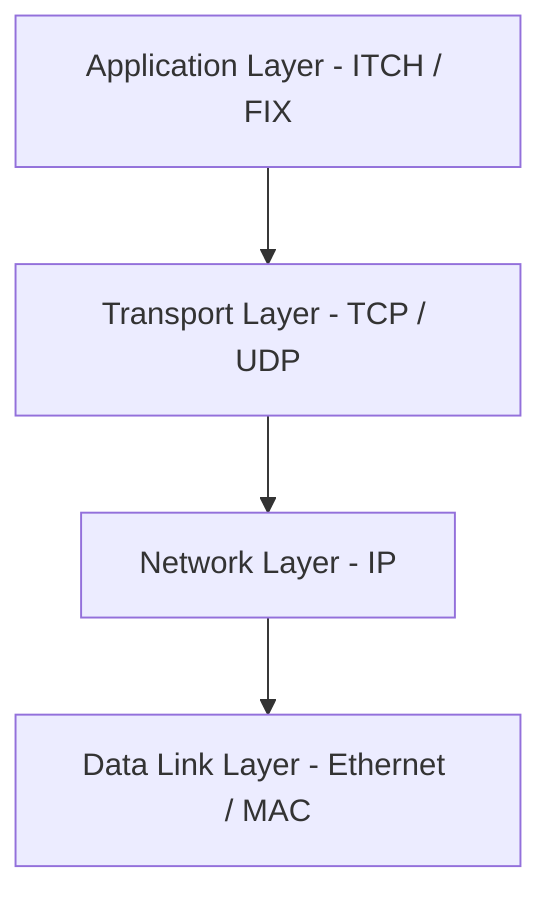
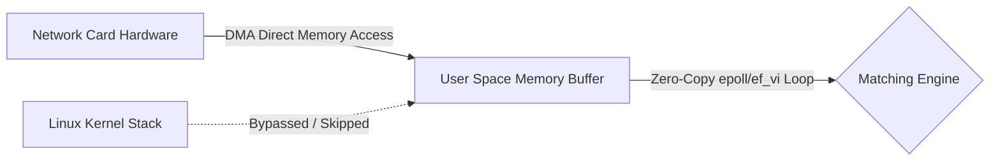
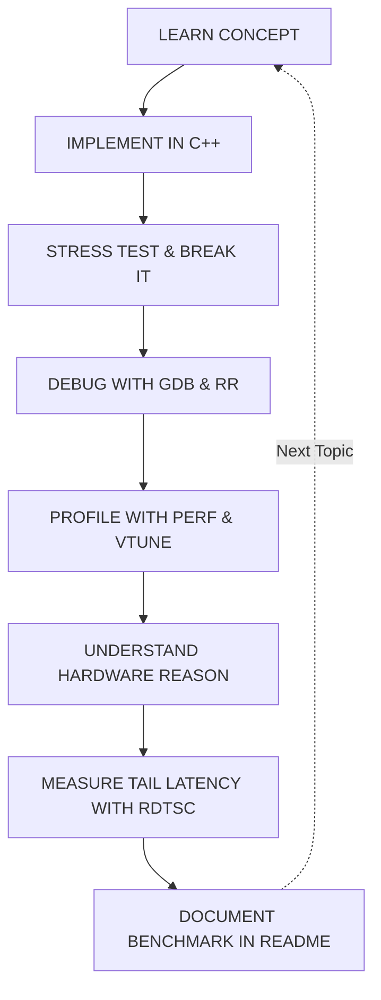

# C++ Systems & Performance Engineering Roadmap

> [!TIP]
> **Goal:** Become exceptionally strong in modern C++, Linux systems, concurrency, performance engineering, networking, and hardware-aware programming.

> [!NOTE]
> **Target Profile:** HFT, low-latency systems, high-performance infrastructure, databases, runtimes, compilers, and strong systems/software roles at top-tier firms.

---

## Roadmap Progression Tiers

| Tier | Candidate Profile & Core Competencies |
| :--- | :--- |
| **THE TOP 1% TIER** | **Lock-Free Primitives** • **Memory Consistency Models** • **Cache Coherence (MESI)** • **Micro-benchmarking** • **Assembly & Inlines** |
| **COMPETITIVE TIER** | Modern C++ (20/23) • Profiling (perf/VTune) • Kernel Bypass (DPDK/ef_vi) • Linux Kernel Tuning • Custom Allocators |
| **BASELINE TIER** | Standard DSA • Socket Programming • CMake • Valgrind • OOP |

### Role Track Specializations

| Role Track | What You Listed That Matters | Missing Essentials You Must Master |
| :--- | :--- | :--- |
| **C++ Core Software Dev (Low-Latency)** | Memory architecture (TLB, cache lines), `perf`, `Valgrind`, `VTune`, `CMake`, `DPDK`/`ef_vi` | **Extreme Concurrency:** Lock-free structures (SPSC, memory orders). **Modern C++ Internals:** Move semantics, `constexpr`/`consteval`, zero-cost abstractions. **OS & Architecture:** MESI, branch prediction, kernel bypass. **DSA:** Fast algorithmic reasoning under strict constraints. |
| **FPGA / Hardware Engineer** | FPGA (Verilog/VHDL, SystemVerilog), ITCH/OUCH parsing on chip, PCIe/Ethernet MAC layers | High-speed digital design, CDC (Clock Domain Crossing), pipeline timing closure, AXI stream interfaces, Vivado/Quartus toolchains. |
| **Quantitative Developer / Researcher** | Market mechanics (Order book matching, FIX, ITCH/OUCH) | Fast mental probability, linear algebra, time-series statistics, vectorized Python/C++ integration, pricing models. |

> [!TIP]
> **Key hiring reality for HFT freshers:** Most HFTs test Computer Architecture, Multithreading, Modern C++, and Advanced DSA/Puzzles during campus/off-campus hiring. You rarely get quizzed on proprietary APIs like `ef_vi` or ITCH/OUCH specifications in interviews, but knowing them makes your resume stand out and gives you an immediate advantage in technical discussions and trial weeks.

# Table of Contents

1. [The Overall Roadmap](#1-the-overall-roadmap)
2. [Phase 0 — Modern C++ Foundation](#2-phase-0--modern-c-foundation)
3. [Phase 1 — What Happens Beneath C++ & Compiler Design](#3-phase-1--what-happens-beneath-c--compiler-design)
4. [Phase 2 — CPU Architecture, Memory, and Hardware](#4-phase-2--cpu-architecture-memory-and-hardware)
5. [Phase 3 — OS Fundamentals & Linux Systems Mastery](#5-phase-3--os-fundamentals--linux-systems-mastery)
6. [Phase 4 — Concurrency & Memory Models](#6-phase-4--concurrency--memory-models)
7. [Phase 5 — Performance Engineering & Reliability](#7-phase-5--performance-engineering--reliability)
8. [Phase 6 — Networking and I/O](#8-phase-6--networking-and-io)
9. [Phase 7 — Advanced I/O and Kernel Bypass](#9-phase-7--advanced-io-and-kernel-bypass)
10. [Phase 8 — x86-64, Assembly, and SIMD](#10-phase-8--x86-64-assembly-and-simd)
11. [Phase 9 — Financial Markets & Trading Mechanics](#11-phase-9--financial-markets--trading-mechanics)
12. [Phase 10 — Quantitative Math & Probability (Quant Track)](#12-phase-10--quantitative-math--probability-quant-track)
13. [Phase 11 — The Hardcore Flagship Projects](#13-phase-11--the-hardcore-flagship-projects)
14. [What Not to Learn Yet](#14-what-not-to-learn-yet)
15. [Weekly Study Split](#15-weekly-study-split)
16. [Free Resources](#16-free-resources)
17. [The Learning Loop](#17-the-learning-loop)

---

# 1. The Overall Roadmap

> [!IMPORTANT]
> Do not try to learn all of this simultaneously. Depth matters more than touching everything once.

The goal is not to become someone who knows the most C++ syntax.
The goal is to become someone who can answer:
- What does this code compile into?
- Where is this object stored?
- Who owns this memory?
- What is its lifetime?
- How does this affect the cache?
- Is this operation thread-safe?
- What does the compiler optimize?
- Where is the actual bottleneck?

---

# 2. Phase 0 — Modern C++ Foundation

> **Overview:** Master the core language, memory lifetime, value semantics, and the modern standard library without runtime overhead.

## Core Topics & Deep Study Guides

- **Pointers and References**
  - *Core Concept:* Raw memory addresses vs type-safe aliases. In HFT, understanding pointer arithmetic and indirection is critical for cache-friendly flat structures.
  - 📖 **Read 1:** [cppreference - Pointer Declaration](https://en.cppreference.com/w/cpp/language/pointer) `[Search: "cppreference pointer declaration"]`
  - 📖 **Read 2:** [LearnCpp - Introduction to Pointers](https://www.learncpp.com/cpp-tutorial/introduction-to-pointers/) `[Search: "learncpp introduction to pointers"]`
  - 🎥 **Watch 1:** [POINTERS in C++](https://www.youtube.com/watch?v=DTxHyVn0ODg) `[Search: "The Cherno POINTERS in C++"]`
  - 🎥 **Watch 2:** [REFERENCES in C++](https://www.youtube.com/watch?v=IzoFn3dfsPA) `[Search: "The Cherno REFERENCES in C++"]`

- **Object Lifetime & Storage Duration**
  - *Core Concept:* Automatic (stack), dynamic (heap), static, and thread-local storage. Knowing exactly when constructors and destructors execute eliminates dangling pointers and memory leaks.
  - 📖 **Read 1:** [cppreference - Lifetime](https://en.cppreference.com/w/cpp/language/lifetime) `[Search: "cppreference object lifetime"]`
  - 📖 **Read 2:** [cppreference - Storage Duration](https://en.cppreference.com/w/cpp/language/storage_duration) `[Search: "cppreference storage duration"]`
  - 🎥 **Watch 1:** [Object Lifetime in C++ (Stack/Scope Lifetimes)](https://www.youtube.com/watch?v=iNuTwvD6ciI) `[Search: "The Cherno Object Lifetime in C++"]`
  - 🎥 **Watch 2:** [Back to Basics: The Abstract Machine - Bob Steagall - CppCon 2020](https://www.youtube.com/watch?v=ZAji7PkXaKY) `[Search: "CppCon Back to Basics: The Abstract Machine"]`

- **Stack vs Heap Allocation**
  - *Core Concept:* Stack memory is instant (pointer bump); heap allocation requires OS syscalls, heap locks, and causes unpredictable latency spikes.
  - 📖 **Read 1:** [LearnCpp - The Stack and the Heap](https://www.learncpp.com/cpp-tutorial/the-stack-and-the-heap/) `[Search: "learncpp the stack and the heap"]`
  - 📖 **Read 2:** [GeeksforGeeks - Stack vs Heap Memory Allocation](https://www.geeksforgeeks.org/stack-vs-heap-memory-allocation/) `[Search: "geeksforgeeks stack vs heap allocation"]`
  - 🎥 **Watch 1:** [Stack vs Heap Memory in C++](https://www.youtube.com/watch?v=wJ1L2nSIV1s) `[Search: "The Cherno Stack vs Heap Memory in C++"]`
  - 🎥 **Watch 2:** [Stack vs Heap Memory - Simple Explanation](https://www.youtube.com/watch?v=5OJRqkYbK-4) `[Search: "Computerphile Stack vs Heap"]`

- **const Correctness & Immutability**
  - *Core Concept:* Compile-time enforcement of read-only state. Enables aggressive compiler optimizations, thread safety reasoning, and prevents accidental state mutation.
  - 📖 **Read 1:** [isocpp FAQ - Const Correctness](https://isocpp.org/wiki/faq/const-correctness) `[Search: "isocpp faq const correctness"]`
  - 📖 **Read 2:** [cppreference - cv-qualifiers](https://en.cppreference.com/w/cpp/language/cv) `[Search: "cppreference cv qualifiers const volatile"]`
  - 🎥 **Watch 1:** [CONST in C++](https://www.youtube.com/watch?v=4fJBrditnJU) `[Search: "The Cherno CONST in C++"]`
  - 🎥 **Watch 2:** [Back to Basics: const and constexpr  - Rainer Grimm - CppCon 2021](https://www.youtube.com/watch?v=tA6LbPyYdco) `[Search: "CppCon Back to Basics const and constexpr Rainer Grimm"]`

- **Value Categories (lvalues, rvalues, prvalues, xvalues)**
  - *Core Concept:* The semantic taxonomy of expressions in C++. Understanding value categories is the prerequisite for writing efficient move constructors and perfect forwarding.
  - 📖 **Read 1:** [cppreference - Value Categories](https://en.cppreference.com/w/cpp/language/value_category) `[Search: "cppreference value categories"]`
  - 📖 **Read 2:** [LearnCpp - Value Categories: lvalues and rvalues](https://www.learncpp.com/cpp-tutorial/value-categories-lvalues-and-rvalues/) `[Search: "learncpp value categories"]`
  - 🎥 **Watch 1:** [lvalues and rvalues in C++](https://www.youtube.com/watch?v=fbYknr-HPYE) `[Search: "The Cherno lvalues and rvalues in C++"]`
  - 🎥 **Watch 2:** [Back to Basics: Understanding Value Categories - Ben Saks - CppCon 2019](https://www.youtube.com/watch?v=XS2JddPq7GQ) `[Search: "CppCon Back to Basics Value Categories"]`

- **Move Semantics & std::move**
  - *Core Concept:* Resource theft from temporaries instead of deep copying. Eliminates buffer allocations when passing messages between network and trading threads.
  - 📖 **Read 1:** [cppreference - std::move](https://en.cppreference.com/w/cpp/utility/move) `[Search: "cppreference std move"]`
  - 📖 **Read 2:** [cppreference - Move Constructors](https://en.cppreference.com/w/cpp/language/move_constructor) `[Search: "cppreference move constructor"]`
  - 🎥 **Watch 1:** [Move Semantics in C++](https://www.youtube.com/watch?v=ehMg6zvXuMY) `[Search: "The Cherno Move Semantics in C++"]`
  - 🎥 **Watch 2:** [Back to Basics: Move Semantics (part 1 of 2) -  Klaus Iglberger - CppCon 2019](https://www.youtube.com/watch?v=St0MNEU5b0o) `[Search: "CppCon Back to Basics: Move Semantics"]`

- **Constructors, Destructors & Rule of 0/3/5**
  - *Core Concept:* Deterministic resource management. Custom copy/move operations ensure correct ownership semantics when wrapping OS resources or shared memory.
  - 📖 **Read 1:** [cppreference - Rule of Three / Five / Zero](https://en.cppreference.com/w/cpp/language/rule_of_three) `[Search: "cppreference rule of three five zero"]`
  - 📖 **Read 2:** [cppreference - Constructors and Member Initializer Lists](https://en.cppreference.com/w/cpp/language/initializer_list) `[Search: "cppreference constructors member initializer"]`
  - 🎥 **Watch 1:** [Constructors in C++](https://www.youtube.com/watch?v=FXhALMsHwEY) `[Search: "The Cherno Constructors in C++"]`
  - 🎥 **Watch 2:** [Destructors in C++](https://www.youtube.com/watch?v=D8cWquReFqw) `[Search: "The Cherno Destructors in C++"]`

- **RAII (Resource Acquisition Is Initialization)**
  - *Core Concept:* Binds the life cycle of a resource (locks, sockets, memory) to object lifetime, guaranteeing leak-free cleanup even during early returns or errors.
  - 📖 **Read 1:** [cppreference - RAII](https://en.cppreference.com/w/cpp/language/raii) `[Search: "cppreference RAII resource acquisition"]`
  - 📖 **Read 2:** [Bjarne Stroustrup - Resource Management](https://www.stroustrup.com/bs_faq2.html#finally) `[Search: "stroustrup resource management RAII"]`
  - 🎥 **Watch 1:** [RAII the only C++ concept that matters](https://www.youtube.com/watch?v=i7_YvsS12PM) `[Search: "What is RAII in C++?"]`
  - 🎥 **Watch 2:** [Back to Basics: RAII and the Rule of Zero - Arthur O'Dwyer - CppCon 2019](https://www.youtube.com/watch?v=7Qgd9B1KuMQ) `[Search: "CppCon Back to Basics RAII Arthur O'Dwyer"]`

- **Exceptions vs std::expected (C++23) & -fno-exceptions**
  - *Core Concept:* Stack unwinding has nondeterministic latency. HFT disables exceptions (-fno-exceptions) and uses monadic error handling with std::expected or std::optional.
  - 📖 **Read 1:** [cppreference - std::expected](https://en.cppreference.com/w/cpp/utility/expected) `[Search: "cppreference std expected"]`
  - 📖 **Read 2:** [cppreference - Exceptions](https://en.cppreference.com/w/cpp/language/exceptions) `[Search: "cppreference exceptions"]`
  - 🎥 **Watch 1:** [CppCon 2018:  Brand & Nash “What Could Possibly Go Wrong?: A Tale of Expectations and Exceptions”](https://www.youtube.com/watch?v=GC4cp4U2f2E) `[Search: "CppCon Brand Nash Expectations and Exceptions"]`
  - 🎥 **Watch 2:** [Pacific++ 2017: Jason Turner "Rethinking Exceptions"](https://www.youtube.com/watch?v=OkgvqjJzH_Y) `[Search: "Pacific++ Jason Turner Rethinking Exceptions"]`

- **Templates & C++20 Concepts**
  - *Core Concept:* Compile-time polymorphism with zero runtime virtual dispatch overhead. Concepts restrict template arguments to produce clean compiler error messages.
  - 📖 **Read 1:** [cppreference - Templates](https://en.cppreference.com/w/cpp/language/templates) `[Search: "cppreference templates"]`
  - 📖 **Read 2:** [cppreference - Constraints and Concepts](https://en.cppreference.com/w/cpp/language/constraints) `[Search: "cppreference constraints and concepts"]`
  - 🎥 **Watch 1:** [Templates in C++](https://www.youtube.com/watch?v=I-hZkUa9mIs) `[Search: "The Cherno Templates in C++"]`
  - 🎥 **Watch 2:** [C++20 Concepts: A Day in the Life - Saar Raz - CppCon 2019](https://www.youtube.com/watch?v=qawSiMIXtE4) `[Search: "CppCon Concepts in C++20"]`

- **Lambdas & Closures**
  - *Core Concept:* Inline anonymous functors. Understanding capture by value ([=]) vs capture by reference ([&]) and how they translate to compiler-generated structs.
  - 📖 **Read 1:** [cppreference - Lambda Expressions](https://en.cppreference.com/w/cpp/language/lambda) `[Search: "cppreference lambda expressions"]`
  - 📖 **Read 2:** [LearnCpp - Introduction to Lambdas](https://www.learncpp.com/cpp-tutorial/introduction-to-lambdas-anonymous-functions/) `[Search: "learncpp introduction to lambdas"]`
  - 🎥 **Watch 1:** [Lambdas in C++](https://www.youtube.com/watch?v=mWgmBBz0y8c) `[Search: "The Cherno Lambdas in C++"]`
  - 🎥 **Watch 2:** [Back to Basics: Lambdas - Nicolai Josuttis - CppCon 2021](https://www.youtube.com/watch?v=IgNUBw3vcO4) `[Search: "CppCon Back to Basics Lambdas"]`

- **constexpr & consteval (Compile-Time Metaprogramming)**
  - *Core Concept:* Moving computation from runtime to compile time. Used in HFT to compute lookup tables, math constants, and protocol hashes before code ever executes.
  - 📖 **Read 1:** [cppreference - constexpr](https://en.cppreference.com/w/cpp/language/constexpr) `[Search: "cppreference constexpr"]`
  - 📖 **Read 2:** [cppreference - consteval](https://en.cppreference.com/w/cpp/language/consteval) `[Search: "cppreference consteval"]`
  - 🎥 **Watch 1:** [Back to Basics: const and constexpr  - Rainer Grimm - CppCon 2021](https://www.youtube.com/watch?v=tA6LbPyYdco) `[Search: "CppCon Back to Basics const and constexpr Rainer Grimm"]`
  - 🎥 **Watch 2:** [CppCon 2017: Ben Deane & Jason Turner “constexpr ALL the Things!”](https://www.youtube.com/watch?v=PJwd4JLYJJY) `[Search: "CppCon constexpr all the things"]`

- **STL Containers (std::vector, std::array, std::deque)**
  - *Core Concept:* Contiguous memory layout gives std::vector and std::array maximum L1/L2 cache locality, making node-based containers (std::list) obsolete in high-performance paths.
  - 📖 **Read 1:** [cppreference - std::vector](https://en.cppreference.com/w/cpp/container/vector) `[Search: "cppreference std vector"]`
  - 📖 **Read 2:** [cppreference - std::array](https://en.cppreference.com/w/cpp/container/array) `[Search: "cppreference std array"]`
  - 🎥 **Watch 1:** [Dynamic Arrays in C++ (std::vector)](https://www.youtube.com/watch?v=PocJ5jXv8No) `[Search: "The Cherno Dynamic Arrays in C++ std vector"]`
  - 🎥 **Watch 2:** [Static Arrays in C++ (std::array)](https://www.youtube.com/watch?v=Hw42GkHPyvk) `[Search: "The Cherno std array in C++"]`

- **Smart Pointers (std::unique_ptr vs std::shared_ptr)**
  - *Core Concept:* Explicit ownership semantics. In low-latency systems, std::shared_ptr is banned in hot paths due to atomic reference counting overhead; std::unique_ptr is zero-cost.
  - 📖 **Read 1:** [cppreference - std::unique_ptr](https://en.cppreference.com/w/cpp/memory/unique_ptr) `[Search: "cppreference std unique_ptr"]`
  - 📖 **Read 2:** [cppreference - std::shared_ptr](https://en.cppreference.com/w/cpp/memory/shared_ptr) `[Search: "cppreference std shared_ptr"]`
  - 🎥 **Watch 1:** [SMART POINTERS in C++ (std::unique_ptr, std::shared_ptr, std::weak_ptr)](https://www.youtube.com/watch?v=UOB7-B2MfwA) `[Search: "The Cherno SMART POINTERS in C++"]`
  - 🎥 **Watch 2:** [CppCon 2019: Arthur O'Dwyer “Back to Basics: Smart Pointers”](https://www.youtube.com/watch?v=xGDLkt-jBJ4) `[Search: "CppCon Back to Basics Smart Pointers Arthur O'Dwyer"]`

- **Vocabulary Types (std::optional, std::variant, std::span, std::string_view)**
  - *Core Concept:* Type-safe, non-owning views and sum types that eliminate dynamic allocation and string copying across APIs.
  - 📖 **Read 1:** [cppreference - std::span](https://en.cppreference.com/w/cpp/container/span) `[Search: "cppreference std span"]`
  - 📖 **Read 2:** [cppreference - std::string_view](https://en.cppreference.com/w/cpp/string/basic_string_view) `[Search: "cppreference std string_view"]`
  - 🎥 **Watch 1:** [How to make your STRINGS FASTER in C++!](https://www.youtube.com/watch?v=ZO68JEgoPeg) `[Search: "The Cherno std string_view in C++"]`
  - 🎥 **Watch 2:** [How to Deal with OPTIONAL Data in C++](https://www.youtube.com/watch?v=UAAiwObNhQ0) `[Search: "The Cherno std optional in C++"]`

- **Algorithms & C++20 Ranges**
  - *Core Concept:* High-performance standard library algorithms that compile into vectorized SIMD loops, and composable ranges without temporary container allocations.
  - 📖 **Read 1:** [cppreference - Algorithms Library](https://en.cppreference.com/w/cpp/algorithm) `[Search: "cppreference algorithms library"]`
  - 📖 **Read 2:** [cppreference - Ranges Library](https://en.cppreference.com/w/cpp/ranges) `[Search: "cppreference ranges library"]`
  - 🎥 **Watch 1:** [CppCon 2018: Jonathan Boccara “105 STL Algorithms in Less Than an Hour”](https://www.youtube.com/watch?v=2olsGf6JIkU) `[Search: "CppCon 105 STL Algorithms in Less Than an Hour Jonathan Boccara"]`
  - 🎥 **Watch 2:** [C++20 Ranges in Practice - Tristan Brindle - CppCon 2020](https://www.youtube.com/watch?v=d_E-VLyUnzc) `[Search: "CppCon C++20 Ranges in Practice"]`

---

# 3. Phase 1 — What Happens Beneath C++ & Compiler Design

> **Overview:** Understand the journey from source code to machine execution: the preprocessor, compiler frontend/backend, linker, and ABI.

## Core Topics & Deep Study Guides

- **Translation Units & The Preprocessor**
  - *Core Concept:* Each .cpp file is preprocessed into an isolated translation unit. Unintended macro expansions or redundant includes cause bloated compile times and subtle bugs.
  - 📖 **Read 1:** [cppreference - Translation Phases](https://en.cppreference.com/w/cpp/language/translation_phases) `[Search: "cppreference translation phases"]`
  - 📖 **Read 2:** [LearnCpp - The Compiler, Linker, and Libraries](https://www.learncpp.com/cpp-tutorial/introduction-to-the-compiler-linker-and-libraries/) `[Search: "learncpp compiler linker libraries"]`
  - 🎥 **Watch 1:** [How C++ Works](https://www.youtube.com/watch?v=SfGuIVzE_Os) `[Search: "The Cherno How C++ Works"]`
  - 🎥 **Watch 2:** [How the C++ Compiler Works](https://www.youtube.com/watch?v=3tIqpEmWMLI) `[Search: "The Cherno How the C++ Compiler Works"]`

- **Headers & Include Guards (#pragma once)**
  - *Core Concept:* Headers declare types and function signatures. Include guards prevent duplicate declarations inside the same translation unit.
  - 📖 **Read 1:** [cppreference - Source File Inclusion](https://en.cppreference.com/w/cpp/preprocessor/include) `[Search: "cppreference source file inclusion"]`
  - 📖 **Read 2:** [LearnCpp - Header Guards](https://www.learncpp.com/cpp-tutorial/header-guards/) `[Search: "learncpp header guards"]`
  - 🎥 **Watch 1:** [C++ Header Files](https://www.youtube.com/watch?v=9RJTQmK0YPI) `[Search: "The Cherno Header Files in C++"]`
  - 🎥 **Watch 2:** [How C++ Works](https://www.youtube.com/watch?v=SfGuIVzE_Os) `[Search: "The Cherno How C++ Works"]`

- **The One Definition Rule (ODR)**
  - *Core Concept:* A class or inline function can be defined across multiple translation units, but must be identical; non-inline functions must have exactly one definition across the whole program.
  - 📖 **Read 1:** [cppreference - Definitions and ODR](https://en.cppreference.com/w/cpp/language/definition) `[Search: "cppreference definitions one definition rule"]`
  - 📖 **Read 2:** [Wikipedia - One Definition Rule](https://en.wikipedia.org/wiki/One_Definition_Rule) `[Search: "wikipedia one definition rule"]`
  - 📖 **Read 3:** [LearnCpp - Programs with Multiple Files & The One Definition Rule](https://www.learncpp.com/cpp-tutorial/programs-with-multiple-code-files/) `[Search: "learncpp programs with multiple code files one definition rule"]`
  - 🎥 **Watch 1:** [Back to Basics: The Abstract Machine - Bob Steagall - CppCon 2020](https://www.youtube.com/watch?v=ZAji7PkXaKY) `[Search: "CppCon Back to Basics: The Abstract Machine"]`
  - 🎥 **Watch 2:** [How the C++ Linker Works](https://www.youtube.com/watch?v=H4s55GgAg0I) `[Search: "The Cherno How the C++ Linker Works"]`

- **Name Mangling & extern "C"**
  - *Core Concept:* C++ encodes parameter types into symbol names to support overloading. extern "C" disables mangling to allow interop with C libraries and OS syscalls.
  - 📖 **Read 1:** [cppreference - Language Linkage (extern C)](https://en.cppreference.com/w/cpp/language/language_linkage) `[Search: "cppreference language linkage extern c"]`
  - 📖 **Read 2:** [Wikipedia - Name Mangling](https://en.wikipedia.org/wiki/Name_mangling) `[Search: "wikipedia name mangling"]`
  - 📖 **Read 3:** [GeeksforGeeks - Name Mangling in C++ and extern C](https://www.geeksforgeeks.org/cpp/extern-c-in-c/) `[Search: "geeksforgeeks extern c in c++ name mangling"]`
  - 🎥 **Watch 1:** [extern "C": Talking to C Programmers about C++ - Dan Saks - CppCon 2016](https://www.youtube.com/watch?v=D7Sd8A6_fYU) `[Search: "Dan Saks extern C Talking to C Programmers about C++ CppCon"]`
  - 🎥 **Watch 2:** [The C++ ABI From the Ground Up - Louis Dionne - CppCon 2019](https://www.youtube.com/watch?v=DZ93lP1I7wU) `[Search: "Louis Dionne The C++ ABI From the Ground Up CppCon"]`

- **Object Files (.o) & ELF Binary Layout**
  - *Core Concept:* Executable and Linkable Format (ELF) stores machine code (.text), initialised data (.data), zero-initialised data (.bss), and symbol tables.
  - 📖 **Read 1:** [Wikipedia - Executable and Linkable Format (ELF)](https://en.wikipedia.org/wiki/Executable_and_Linkable_Format) `[Search: "wikipedia ELF executable linkable format"]`
  - 📖 **Read 2:** [Linux Manual - elf(5)](https://man7.org/linux/man-pages/man5/elf.5.html) `[Search: "man7 elf manual"]`
  - 📖 **Read 3:** [Ian Lance Taylor - Linkers part 1 & ELF Section Headers](https://www.airs.com/blog/archives/38) `[Search: "ian lance taylor linkers part 1 elf archives 38"]`
  - 🎥 **Watch 1:** [Why Use Binary? - Computerphile](https://www.youtube.com/watch?v=thrx3SBEpL8) `[Search: "Computerphile Dissecting Binaries"]`
  - 🎥 **Watch 2:** [In-depth: ELF - The Extensible & Linkable Format](https://www.youtube.com/watch?v=nC1U1LJQL8o) `[Search: "stacksmashing In-depth: ELF - The Extensible & Linkable Format"]`

- **Symbol Resolution & Linker Mechanics**
  - *Core Concept:* How the linker resolves undefined symbol references across object files and static archives (.a), detecting multiple definitions or missing symbols.
  - 📖 **Read 1:** [GNU ld Linker Documentation](https://sourceware.org/binutils/docs/ld/) `[Search: "gnu ld linker documentation"]`
  - 📖 **Read 2:** [Linux Manual - nm(1) Symbol Table Examiner](https://man7.org/linux/man-pages/man1/nm.1.html) `[Search: "man7 nm symbol table examiner"]`
  - 🎥 **Watch 1:** [How the C++ Linker Works](https://www.youtube.com/watch?v=H4s55GgAg0I) `[Search: "The Cherno How the C++ Linker Works"]`
  - 🎥 **Watch 2:** [Linkers, Loaders and Shared Libraries in Windows, Linux, and C++ - Ofek Shilon - CppCon 2023](https://www.youtube.com/watch?v=_enXuIxuNV4) `[Search: "CppCon Linkers Loaders and Shared Libraries"]`

- **Static vs Dynamic Linking (PLT & GOT Overhead)**
  - *Core Concept:* Static linking embeds code directly into the binary; dynamic linking (.so) resolves symbols at runtime via the Procedure Linkage Table (PLT) and Global Offset Table (GOT), adding branch indirection.
  - 📖 **Read 1:** [Ulrich Drepper - How To Write Shared Libraries](https://akkadia.org/drepper/dsohowto.pdf) `[Search: "ulrich drepper how to write shared libraries"]`
  - 📖 **Read 2:** [Wikipedia - Dynamic Linker](https://en.wikipedia.org/wiki/Dynamic_linker) `[Search: "wikipedia dynamic linker PLT GOT"]`
  - 📖 **Read 3:** [Eli Bendersky - Position Independent Code (PIC) in Shared Libraries](https://eli.thegreenplace.net/2011/11/03/position-independent-code-pic-in-shared-libraries/) `[Search: "eli bendersky position independent code pic shared libraries"]`
  - 🎥 **Watch 1:** [Linkers, Loaders and Shared Libraries in Windows, Linux, and C++ - Ofek Shilon - CppCon 2023](https://www.youtube.com/watch?v=_enXuIxuNV4) `[Search: "CppCon Linkers, Loaders and Shared Libraries in Windows, Linux, and C++"]`
  - 🎥 **Watch 2:** [Using Libraries in C++ (Static Linking)](https://www.youtube.com/watch?v=or1dAmUO8k0) `[Search: "The Cherno Static vs Dynamic Linking"]`

- **Application Binary Interface (ABI)**
  - *Core Concept:* The calling convention, register usage, stack frame layout, and struct memory padding agreed upon between compilers and libraries. Incompatible ABIs cause silent memory corruption.
  - 📖 **Read 1:** [Wikipedia - Application Binary Interface](https://en.wikipedia.org/wiki/Application_binary_interface) `[Search: "wikipedia application binary interface"]`
  - 📖 **Read 2:** [Itanium C++ ABI Specification](https://itanium-cxx-abi.github.io/cxx-abi/abi.html) `[Search: "itanium cxx abi specification"]`
  - 📖 **Read 3:** [Red Hat Developer - How C++ ABI Works in Practice](https://developers.redhat.com/blog/2019/04/22/c-abi-stability-in-fedora) `[Search: "red hat developer c++ abi stability"]`
  - 🎥 **Watch 1:** [What is an ABI, and Why is Breaking it Bad? - Marshall Clow - CppCon 2020](https://www.youtube.com/watch?v=7RoTDjLLXJQ) `[Search: "CppCon What is an ABI and Why is Breaking it so Hard"]`
  - 🎥 **Watch 2:** [CppCon 2018: Titus Winters “Standard Library Compatibility Guidelines (SD-8)”](https://www.youtube.com/watch?v=BWvSSsKCiAw) `[Search: "Titus Winters The Day The Standard Library Stopped Improving"]`

- **Compiler Pipeline: Frontend, Middle-End (IR), and Backend**
  - *Core Concept:* Clang/GCC transforms tokens into an Abstract Syntax Tree (AST), emits Intermediate Representation (LLVM IR / GIMPLE) for optimization passes, and generates target machine assembly.
  - 📖 **Read 1:** [LLVM Project Documentation](https://llvm.org/docs/) `[Search: "llvm project documentation"]`
  - 📖 **Read 2:** [Compiler Explorer (Godbolt)](https://godbolt.org/) `[Search: "compiler explorer godbolt"]`
  - 🎥 **Watch 1:** [CppCon 2017: Matt Godbolt “What Has My Compiler Done for Me Lately? Unbolting the Compiler's Lid”](https://www.youtube.com/watch?v=bSkpMdDe4g4) `[Search: "CppCon 2017: Matt Godbolt “What Has My Compiler Done for Me Lately? Unbolting the Compiler's Lid”"]`
  - 🎥 **Watch 2:** [Building an LLVM-based tool. Lessons learned](https://www.youtube.com/watch?v=3ynGoOsbRxI) `[Search: "Alex Denisov Introduction to LLVM"]`

- **Link-Time Optimization (LTO) & Profile-Guided Optimization (PGO)**
  - *Core Concept:* LTO enables inlining and dead-code stripping across translation units at link time. PGO instruments a binary, gathers production branch probabilities, and reorganizes code layout for maximum cache hit rate.
  - 📖 **Read 1:** [GCC Documentation - Options That Control Optimization](https://gcc.gnu.org/onlinedocs/gcc/Optimize-Options.html) `[Search: "gcc optimize options lto pgo"]`
  - 📖 **Read 2:** [LLVM - Link Time Optimization](https://llvm.org/docs/LinkTimeOptimization.html) `[Search: "llvm link time optimization"]`
  - 🎥 **Watch 1:** [CppCon 2017: Teresa Johnson “ThinLTO: Scalable and Incremental Link-Time Optimization”](https://www.youtube.com/watch?v=p9nH2vZ2mNo) `[Search: "CppCon Link Time Optimization"]`
  - 🎥 **Watch 2:** [Profile-Guided Optimization (PGO) Explained: Faster Code with Runtime Data](https://www.youtube.com/watch?v=3LPlMgxvqy8) `[Search: "CppCon Profile Guided Optimization"]`

---

# 4. Phase 2 — CPU Architecture, Memory, and Hardware

> **Overview:** Mechanical empathy: design contiguous data structures aligned with CPU cache hierarchies, prefetchers, and memory controllers.

## Core Topics & Deep Study Guides

- **Memory Hierarchy (Registers, L1, L2, L3, RAM)**
  - *Core Concept:* Registers (~0.5ns), L1 cache (~1ns), L2 (~3ns), L3 (~15ns), RAM (~100ns). Low-latency C++ is about keeping the working set inside L1/L2 caches to eliminate pipeline stalls.
  - 📖 **Read 1:** [Ulrich Drepper - What Every Programmer Should Know About Memory](https://people.freebsd.org/~lstewart/articles/cpumemory.pdf) `[Search: "what every programmer should know about memory ulrich drepper"]`
  - 📖 **Read 2:** [Wikipedia - CPU Cache](https://en.wikipedia.org/wiki/CPU_cache) `[Search: "wikipedia cpu cache hierarchy"]`
  - 📖 **Read 3:** [Latency Numbers Every Programmer Should Know (Interactive Reference)](https://gist.github.com/jboner/2841832) `[Search: "latency numbers every programmer should know jboner gist"]`
  - 🎥 **Watch 1:** [code::dive conference 2014 - Scott Meyers: Cpu Caches and Why You Care](https://www.youtube.com/watch?v=WDIkqP4JbkE) `[Search: "code::dive conference 2014 - Scott Meyers: Cpu Caches and Why You Care"]`
  - 🎥 **Watch 2:** [How CPU Memory & Caches Work - Computerphile](https://www.youtube.com/watch?v=SAk-6gVkio0) `[Search: "Computerphile How CPU Memory & Caches Work"]`

- **Cache Lines (64 Bytes) & Data Alignment (alignas)**
  - *Core Concept:* CPUs transfer data from RAM in 64-byte chunks. Misaligned data structures spanning multiple cache lines cause dual memory fetches. Use alignas(64) to align hot data.
  - 📖 **Read 1:** [cppreference - alignas Specifier](https://en.cppreference.com/w/cpp/language/alignas) `[Search: "cppreference alignas specifier"]`
  - 📖 **Read 2:** [cppreference - std::hardware_destructive_interference_size](https://en.cppreference.com/w/cpp/thread/hardware_destructive_interference_size) `[Search: "cppreference hardware destructive interference size"]`
  - 🎥 **Watch 1:** [Why do CPUs Need Caches? - Computerphile](https://www.youtube.com/watch?v=6JpLD3PUAZk) `[Search: "Computerphile Why do CPUs Need Caches?"]`
  - 🎥 **Watch 2:** [CppCon 2014: Mike Acton "Data-Oriented Design and C++"](https://www.youtube.com/watch?v=rX0ItVEVjHc) `[Search: "CppCon Data-oriented Design and Cache Locality"]`

- **Spatial & Temporal Locality & Hardware Prefetchers**
  - *Core Concept:* Spatial locality accesses consecutive memory addresses, triggering the CPU stream prefetcher. Temporal locality reuses recently accessed data before cache eviction.
  - 📖 **Read 1:** [Wikipedia - Locality of Reference](https://en.wikipedia.org/wiki/Locality_of_reference) `[Search: "wikipedia locality of reference"]`
  - 📖 **Read 2:** [Data-Oriented Design (Richard Fabian)](https://www.dataorienteddesign.com/dodbook/) `[Search: "data oriented design richard fabian"]`
  - 📖 **Read 3:** [Gallery of Processor Cache Effects (Concrete Code Benchmarks)](https://igoro.com/archive/gallery-of-processor-cache-effects/) `[Search: "gallery of processor cache effects igoro"]`
  - 🎥 **Watch 1:** [code::dive conference 2014 - Scott Meyers: Cpu Caches and Why You Care](https://www.youtube.com/watch?v=WDIkqP4JbkE) `[Search: "Scott Meyers Cpu Caches and Why You Care"]`
  - 🎥 **Watch 2:** [CppCon 2014: Mike Acton "Data-Oriented Design and C++"](https://www.youtube.com/watch?v=rX0ItVEVjHc) `[Search: "Mike Acton Data-Oriented Design and C++ CppCon"]`

- **Virtual Memory, Paging, and TLB**
  - *Core Concept:* The Memory Management Unit (MMU) translates virtual addresses to physical frames using page tables. The Translation Lookaside Buffer (TLB) caches translations; a TLB miss costs a multi-level page table walk.
  - 📖 **Read 1:** [Wikipedia - Translation Lookaside Buffer](https://en.wikipedia.org/wiki/Translation_lookaside_buffer) `[Search: "wikipedia translation lookaside buffer tlb"]`
  - 📖 **Read 2:** [Wikipedia - Virtual Memory](https://en.wikipedia.org/wiki/Virtual_memory) `[Search: "wikipedia virtual memory paging"]`
  - 📖 **Read 3:** [Gustavo Duarte - How The Linux Kernel Manages Your Memory](https://manybutfinite.com/post/how-the-kernel-manages-your-memory/) `[Search: "gustavo duarte how the kernel manages your memory"]`
  - 🎥 **Watch 1:** [What's Virtual Memory? - Computerphile](https://www.youtube.com/watch?v=5lFnKYCZT5o) `[Search: "Computerphile Virtual Memory & Paging"]`
  - 🎥 **Watch 2:** [1.2.1 What is Information?](https://www.youtube.com/watch?v=R0tFDXBZvKI) `[Search: "MIT 6.004 Translation Lookaside Buffer"]`

- **HugePages (2MB / 1GB) & Page Fault Elimination**
  - *Core Concept:* Default 4KB pages exhaust the TLB with large working sets. Configuring 2MB or 1GB static HugePages reduces page table entries by orders of magnitude, eliminating TLB thrashing.
  - 📖 **Read 1:** [Linux Kernel Documentation - HugeTLB Pages](https://www.kernel.org/doc/html/latest/admin-guide/mm/hugetlbpage.html) `[Search: "linux kernel hugetlb pages documentation"]`
  - 📖 **Read 2:** [Red Hat Documentation - HugePages](https://access.redhat.com/documentation/en-us/red_hat_enterprise_linux/7/html/performance_tuning_guide/chap-red_hat_enterprise_linux-performance_tuning_guide-memory) `[Search: "red hat memory performance tuning hugepages"]`
  - 🎥 **Watch 1:** [Mentorship Session: Huge Page Concepts in Linux](https://www.youtube.com/watch?v=n67gCNiKVcw) `[Search: "Huge Pages in Linux Explained"]`
  - 🎥 **Watch 2:** [Matrix Multiplication Deep Dive || Cache Blocking, SIMD & Parallelization - Aliaksei Sala - CppCon](https://www.youtube.com/watch?v=GHctcSBd6Z4) `[Search: "CppCon HugePages Performance"]`

- **Cache Coherence & MESI / MOESI Protocols**
  - *Core Concept:* Modified, Exclusive, Shared, Invalid states. When Core 1 writes to a shared cache line, it broadcasts an invalidate message to Core 2's L1 cache via the cache coherence bus.
  - 📖 **Read 1:** [Wikipedia - MESI Protocol](https://en.wikipedia.org/wiki/MESI_protocol) `[Search: "wikipedia MESI protocol cache coherence"]`
  - 📖 **Read 2:** [Wikipedia - MOESI Protocol](https://en.wikipedia.org/wiki/MOESI_protocol) `[Search: "wikipedia MOESI protocol"]`
  - 📖 **Read 3:** [C++ Core Guidelines - Concurrency and Shared State](https://isocpp.github.io/CppCoreGuidelines/CppCoreGuidelines#cp-concurrency) `[Search: "isocpp core guidelines concurrency shared state"]`
  - 🎥 **Watch 1:** [Cache Coherence Problem & Cache Coherency Protocols](https://www.youtube.com/watch?v=r_ZE1XVT8Ao) `[Search: "Computerphile Cache Coherence"]`
  - 🎥 **Watch 2:** [Lecture 29. Cache Coherence - Carnegie Mellon - Computer Architecture 2015 - Onur Mutlu](https://www.youtube.com/watch?v=X6DZchnMYcw) `[Search: "Carnegie Mellon Cache Coherence Protocols"]`

- **Store Buffers, Invalidation Queues & Memory Fences**
  - *Core Concept:* CPUs buffer pending writes in store buffers to avoid waiting on cache invalidation acknowledgments. This hardware optimization causes out-of-order memory visibility across cores without memory fences.
  - 📖 **Read 1:** [Paul McKenney - Memory Barriers: a Hardware View for Software Hackers](https://www.kernel.org/doc/Documentation/memory-barriers.txt) `[Search: "linux kernel memory barriers documentation paul mckenney"]`
  - 📖 **Read 2:** [Wikipedia - Memory Barrier](https://en.wikipedia.org/wiki/Memory_barrier) `[Search: "wikipedia memory barrier store buffer"]`
  - 📖 **Read 3:** [Preshing on Programming - Memory Barriers Are Like Source Control Operations](https://preshing.com/20120710/memory-barriers-are-like-source-control-operations/) `[Search: "preshing memory barriers are like source control operations"]`
  - 🎥 **Watch 1:** [CppCon 2017: Fedor Pikus “C++ atomics, from basic to advanced.  What do they really do?”](https://www.youtube.com/watch?v=ZQFzMfHIxng) `[Search: "CppCon The C++ Memory Model Fedor Pikus"]`
  - 🎥 **Watch 2:** [C++ and Beyond 2012: Herb Sutter - atomic Weapons 1 of 2](https://www.youtube.com/watch?v=A8eCGOqgvH4) `[Search: "Herb Sutter atomic Weapons 1"]`

- **False Sharing & Cache Contention**
  - *Core Concept:* When two threads on separate cores modify independent variables located on the same 64-byte cache line, the line constantly bounces between cores, destroying throughput.
  - 📖 **Read 1:** [Wikipedia - False Sharing](https://en.wikipedia.org/wiki/False_sharing) `[Search: "wikipedia false sharing"]`
  - 📖 **Read 2:** [Intel - Avoid False Sharing in Multithreaded Code](https://www.intel.com/content/www/us/en/developer/articles/technical/avoiding-and-identifying-false-sharing-among-threads.html) `[Search: "intel avoid false sharing multithreaded code"]`
  - 📖 **Read 3:** [Preshing on Programming - You Can Do Any Kind of Atomic Read-Modify-Write](https://preshing.com/20150402/you-can-do-any-kind-of-atomic-read-modify-write-operation/) `[Search: "preshing atomic read modify write operation"]`
  - 🎥 **Watch 1:** [false sharing and impact on system's performance || c++ advanced techniques & optimizations for HFT](https://www.youtube.com/watch?v=OJNhcAe1GZM) `[Search: "false sharing and impact on system's performance c++ HFT"]`
  - 🎥 **Watch 2:** [Back to Basics: Concurrency - Arthur O'Dwyer - CppCon 2020](https://www.youtube.com/watch?v=F6Ipn7gCOsY) `[Search: "CppCon Back to Basics Concurrency Arthur O'Dwyer"]`

- **Branch Prediction Internals & BTB (Branch Target Buffer)**
  - *Core Concept:* Modern CPU pipelines speculate instructions ahead of time. Branch mispredictions cost 15-20 cycles flushing the pipeline. Use [[likely]] / [[unlikely]] and branchless code in hot decision paths.
  - 📖 **Read 1:** [Wikipedia - Branch Predictor](https://en.wikipedia.org/wiki/Branch_predictor) `[Search: "wikipedia branch predictor btb"]`
  - 📖 **Read 2:** [cppreference - Attributes: likely / unlikely](https://en.cppreference.com/w/cpp/language/attributes/likely) `[Search: "cppreference attributes likely unlikely"]`
  - 📖 **Read 3:** [Dan Luu - Branch Prediction and Branch Target Buffer Performance](https://danluu.com/branch-prediction/) `[Search: "dan luu branch prediction performance"]`
  - 🎥 **Watch 1:** [How Branch Prediction Works in CPUs - Computerphile](https://www.youtube.com/watch?v=nczJ58WvtYo) `[Search: "Computerphile How Branch Prediction Works in CPUs"]`
  - 🎥 **Watch 2:** [Branchless Programming in C++ - Fedor Pikus - CppCon 2021](https://www.youtube.com/watch?v=g-WPhYREFjk) `[Search: "CppCon Branchless Programming in C++ Fedor Pikus"]`

- **NUMA (Non-Uniform Memory Access) & CPU Affinity**
  - *Core Concept:* Accessing memory attached to a remote CPU socket over the interconnect (QPI/UPI) incurs a ~2x latency penalty. Thread pinning (pthread_setaffinity_np) ensures core execution matches memory node binding.
  - 📖 **Read 1:** [Wikipedia - Non-Uniform Memory Access](https://en.wikipedia.org/wiki/Non-uniform_memory_access) `[Search: "wikipedia numa non uniform memory access"]`
  - 📖 **Read 2:** [Linux Manual - pthread_setaffinity_np(3)](https://man7.org/linux/man-pages/man3/pthread_setaffinity_np.3.html) `[Search: "man7 pthread_setaffinity_np"]`
  - 📖 **Read 3:** [LWN.net - What Every Programmer Should Know About NUMA (Ulrich Drepper)](https://lwn.net/Articles/254445/) `[Search: "lwn net what every programmer should know about memory numa"]`
  - 🎥 **Watch 1:** [NUMA Architecture| Non Uniform Memory Access Policy/Model | Numa Node Configuration (CPU Affinity)](https://www.youtube.com/watch?v=gCOEunP5kjs) `[Search: "NUMA Architecture Explained"]`
  - 🎥 **Watch 2:** [Non-Uniform Memory Architecture (NUMA): A Nearly Unfathomable Morass of Arcana - Fedor Pikus  CppNow](https://www.youtube.com/watch?v=f0ZKBusa4CI) `[Search: "CppCon High Performance Code on Modern Hardware NUMA"]`

---

# 5. Phase 3 — OS Fundamentals & Linux Systems Mastery

> **Overview:** Master the Linux operating system as a low-level systems programmer: kernel space vs user space, syscall overhead, and deterministic core isolation.

## Core Topics & Deep Study Guides

- **Process vs Thread Execution Models**
  - *Core Concept:* Processes isolate memory spaces; threads share the heap and file descriptor table but maintain private stack frames, registers, and Thread-Local Storage (TLS).
  - 📖 **Read 1:** [Wikipedia - Process (computing)](https://en.wikipedia.org/wiki/Process_%28computing%29) `[Search: "wikipedia process computing"]`
  - 📖 **Read 2:** [Wikipedia - Thread (computing)](https://en.wikipedia.org/wiki/Thread_%28computing%29) `[Search: "wikipedia thread computing"]`
  - 📖 **Read 3:** [GeeksforGeeks - Difference Between Process and Thread](https://www.geeksforgeeks.org/operating-systems/difference-between-process-and-thread/) `[Search: "geeksforgeeks difference between process and thread"]`
  - 🎥 **Watch 1:** [Multithreading Code - Computerphile](https://www.youtube.com/watch?v=7ENFeb-J75k) `[Search: "Computerphile Processes vs Threads"]`
  - 🎥 **Watch 2:** [Threads in C++](https://www.youtube.com/watch?v=wXBcwHwIt_I) `[Search: "The Cherno Threads in C++"]`

- **Context Switches & OS Scheduler Latency**
  - *Core Concept:* The kernel saving CPU register states, switching page tables, and restoring another thread's state. Incurs direct execution overhead and wipes L1 cache and TLB lines.
  - 📖 **Read 1:** [Wikipedia - Context Switch](https://en.wikipedia.org/wiki/Context_switch) `[Search: "wikipedia context switch"]`
  - 📖 **Read 2:** [Linux Kernel Documentation - Real-Time Scheduler](https://www.kernel.org/doc/html/latest/scheduler/sched-rt-group.html) `[Search: "linux kernel real time scheduler documentation"]`
  - 📖 **Read 3:** [Eli Bendersky - Measuring Context Switching and Memory Overheads for Linux Threads](https://eli.thegreenplace.net/2018/measuring-context-switching-and-memory-overheads-for-linux-threads/) `[Search: "eli bendersky measuring context switching and memory overheads linux threads"]`
  - 🎥 **Watch 1:** [OS Context Switching - Computerphile](https://www.youtube.com/watch?v=DKmBRl8j3Ak) `[Search: "Computerphile Context Switching"]`
  - 🎥 **Watch 2:** [Context Switching | OS Process Management Explained](https://www.youtube.com/watch?v=ajs6sWOXlpc) `[Search: "Operating System Context Switching Explained"]`

- **System Calls (Syscalls) & User-to-Kernel Transitions**
  - *Core Concept:* Syscall instructions (syscall on x86) transition execution rings, flush CPU pipelines, and invoke kernel privilege checks. Low-latency systems avoid syscalls entirely in the hot path.
  - 📖 **Read 1:** [Linux Manual - syscalls(2)](https://man7.org/linux/man-pages/man2/syscalls.2.html) `[Search: "man7 syscalls linux manual"]`
  - 📖 **Read 2:** [Wikipedia - System Call](https://en.wikipedia.org/wiki/System_call) `[Search: "wikipedia system call"]`
  - 📖 **Read 3:** [LWN.net - Anatomy of a Linux System Call](https://lwn.net/Articles/604287/) `[Search: "lwn net anatomy of a system call"]`
  - 🎥 **Watch 1:** [L-1.7: System Calls in Operating system and its types in Hindi](https://www.youtube.com/watch?v=tWPa-rZiGM8) `[Search: "Computerphile System Calls"]`
  - 🎥 **Watch 2:** [Linux Tutorial: How a Linux System Call Works](https://www.youtube.com/watch?v=FkIWDAtVIUM) `[Search: "How System Calls Work in Linux"]`

- **File Descriptors & Kernel Object Tables**
  - *Core Concept:* Integer indexes into the process file descriptor table pointing to open file descriptions, sockets, pipes, timerfds, and eventfds.
  - 📖 **Read 1:** [Wikipedia - File Descriptor](https://en.wikipedia.org/wiki/File_descriptor) `[Search: "wikipedia file descriptor"]`
  - 📖 **Read 2:** [Linux Manual - fcntl(2)](https://man7.org/linux/man-pages/man2/fcntl.2.html) `[Search: "man7 fcntl file control options"]`
  - 📖 **Read 3:** [Bottom Up Computer Science - File Descriptors and Kernel Tables](https://bottomupcs.com/ch01s03.html) `[Search: "bottom up computer science file descriptors kernel tables"]`
  - 🎥 **Watch 1:** ["Everything is a file" in UNIX](https://www.youtube.com/watch?v=dDwXnB6XeiA) `[Search: "Everything is a File in UNIX"]`
  - 🎥 **Watch 2:** [Linux File Descriptors Explained | Fix "Too Many Open Files" in 2026](https://www.youtube.com/watch?v=lQ4KD2erlYE) `[Search: "File Descriptors in Linux Explained"]`

- **Memory-Mapped Files (mmap) & Zero-Copy IPC**
  - *Core Concept:* mmap maps files or shared memory (/dev/shm) directly into process virtual memory, eliminating buffer copies between kernel and user space for ultra-fast logging and inter-process communication.
  - 📖 **Read 1:** [Linux Manual - mmap(2)](https://man7.org/linux/man-pages/man2/mmap.2.html) `[Search: "man7 mmap memory map files"]`
  - 📖 **Read 2:** [Wikipedia - Memory-Mapped File](https://en.wikipedia.org/wiki/Memory-mapped_file) `[Search: "wikipedia memory mapped file"]`
  - 📖 **Read 3:** [Linux Journal - Advanced Memory Allocation with mmap](https://www.linuxjournal.com/article/10678) `[Search: "linux journal advanced memory allocation mmap"]`
  - 🎥 **Watch 1:** [Let's code a Linux Driver - 32: The mmap Callback](https://www.youtube.com/watch?v=tWaEXpG7h0U) `[Search: "mmap Linux System Call Tutorial"]`
  - 🎥 **Watch 2:** [Simple Shared Memory in C (mmap)](https://www.youtube.com/watch?v=rPV6b8BUwxM) `[Search: "Inter-Process Communication with Shared Memory mmap"]`

- **Signals & Asynchronous Interrupt Handling**
  - *Core Concept:* Software interrupts sent by the kernel (SIGSEGV, SIGINT, SIGPIPE). Understanding async-signal-safe functions and avoiding deadlocks in signal handlers.
  - 📖 **Read 1:** [Linux Manual - signal(7)](https://man7.org/linux/man-pages/man7/signal.7.html) `[Search: "man7 signal overview linux"]`
  - 📖 **Read 2:** [Linux Manual - sigaction(2)](https://man7.org/linux/man-pages/man2/sigaction.2.html) `[Search: "man7 sigaction examine change signal action"]`
  - 🎥 **Watch 1:** [Short introduction to signals in C](https://www.youtube.com/watch?v=5We_HtLlAbs) `[Search: "Linux Signals in C"]`
  - 🎥 **Watch 2:** [Process Signals in Linux | SIGINT , SIGKILL , SIGTERM , SIGCONT , SIGTSTP... | kill command in linux](https://www.youtube.com/watch?v=JWQfR_3ddYA) `[Search: "Handling Signals in Linux C++"]`

- **Kernel Core Isolation (isolcpus, nohz_full, rcu_nocbs)**
  - *Core Concept:* Dedicating CPU cores exclusively to trading processes by instructing the Linux scheduler and kernel timer interrupts to stay away from designated cores.
  - 📖 **Read 1:** [Linux Kernel Parameters Documentation](https://www.kernel.org/doc/html/latest/admin-guide/kernel-parameters.html) `[Search: "linux kernel parameters isolcpus nohz_full"]`
  - 📖 **Read 2:** [Red Hat Documentation - Isolating CPUs](https://access.redhat.com/documentation/en-us/red_hat_enterprise_linux_for_real_time/7/html/tuning_guide/isolating_cpus_using_tuned_profiles) `[Search: "red hat real time tuning isolating cpus"]`
  - 🎥 **Watch 1:** [How to Configure Linux Kernel for Real-Time Applications | Deterministic Low Latency Performance](https://www.youtube.com/watch?v=iqWLWagb5JM) `[Search: "Linux Real-Time Kernel Tuning isolcpus deterministic low latency"]`
  - 🎥 **Watch 2:** [What is Low Latency C++? (Part 1) - Timur Doumler - CppNow 2023](https://www.youtube.com/watch?v=EzmNeAhWqVs) `[Search: "CppCon Low Latency Linux System Tuning"]`

- **System Jitter & CPU Power States (C-States, P-States, Turbo Boost)**
  - *Core Concept:* Disabling energy-saving states (intel_idle.max_cstate=0) and CPU frequency governors (performance mode) to guarantee consistent nanosecond response times without thermal throttling or frequency spin-up delay.
  - 📖 **Read 1:** [Linux Kernel Documentation - CPU Performance Scaling](https://www.kernel.org/doc/html/latest/admin-guide/pm/cpufreq.html) `[Search: "linux kernel cpufreq documentation"]`
  - 📖 **Read 2:** [Intel - C-States, P-States, and CPU Power Management](https://www.intel.com/content/www/us/en/developer/articles/technical/intel-power-governor.html) `[Search: "intel power management c states p states"]`
  - 🎥 **Watch 1:** [CPU Performance Parameters in COA: Average CPI, MIPS, and Execution Time | COA](https://www.youtube.com/watch?v=5ayaVunXFUY) `[Search: "CPU Frequency Scaling and C-States Linux"]`
  - 🎥 **Watch 2:** [Basic Real-time kernel optimization in Linux | Lower latency, better performance #linuxcnc #linux](https://www.youtube.com/watch?v=N9tv5LoZuHI) `[Search: "Latency Jitter Reduction in Linux"]`

- **Memory Locking (mlockall) to Prevent Page Swapping**
  - *Core Concept:* Using mlockall(MCL_CURRENT | MCL_FUTURE) to lock the entire address space in physical RAM, preventing the OS virtual memory manager from ever paging out trading code or memory buffers to disk.
  - 📖 **Read 1:** [Linux Manual - mlockall(2)](https://man7.org/linux/man-pages/man2/mlockall.2.html) `[Search: "man7 mlockall lock unlock memory"]`
  - 📖 **Read 2:** [Wikipedia - Virtual Memory Paging](https://en.wikipedia.org/wiki/Paging) `[Search: "wikipedia virtual memory paging page out"]`
  - 📖 **Read 3:** [Red Hat Enterprise Linux - Tuning Real-Time Memory Management](https://access.redhat.com/documentation/en-us/red_hat_enterprise_linux_for_real_time/7/html/tuning_guide/chap-real_time_memory_management) `[Search: "red hat tuning guide real time memory management mlockall"]`
  - 🎥 **Watch 1:** [Lock your memory for better performance and security](https://www.youtube.com/watch?v=sdysoT9VHvw) `[Search: "mlockall Linux Memory Locking Tutorial"]`
  - 🎥 **Watch 2:** [Writing Linux Real-Time Applications (John Ogness, Linutronix)](https://www.youtube.com/watch?v=PCo0DqUXJ5o) `[Search: "Real-Time Linux Programming with mlockall"]`

---

# 6. Phase 4 — Concurrency & Memory Models

> **Overview:** Master multithreading, atomic instructions, lock-free queues, memory consistency models, and safe memory reclamation.

## Core Topics & Deep Study Guides

- **Thread Synchronization & Critical Sections (std::mutex)**
  - *Core Concept:* Standard mutual exclusion. A locked thread is put to sleep by the kernel (futex syscall), incurring a multi-microsecond wake-up penalty when uncontended access fails.
  - 📖 **Read 1:** [cppreference - std::mutex](https://en.cppreference.com/w/cpp/thread/mutex) `[Search: "cppreference std mutex"]`
  - 📖 **Read 2:** [cppreference - std::unique_lock](https://en.cppreference.com/w/cpp/thread/unique_lock) `[Search: "cppreference std unique_lock"]`
  - 🎥 **Watch 1:** [Threads in C++ (std::thread & std::mutex)](https://www.youtube.com/watch?v=wXBcwHwIt_I) `[Search: "The Cherno Threads in C++ std::thread std::mutex"]`
  - 🎥 **Watch 2:** [Back to Basics: Concurrency - Arthur O'Dwyer - CppCon 2020](https://www.youtube.com/watch?v=F6Ipn7gCOsY) `[Search: "CppCon Back to Basics: Concurrency Arthur O'Dwyer"]`

- **Spinlocks vs Sleep Mutexes**
  - *Core Concept:* Spinlocks actively poll atomic state in a tight loop without relinquishing the CPU core. Burning 100% CPU on an isolated core yields sub-microsecond handoffs at the cost of power.
  - 📖 **Read 1:** [Wikipedia - Spinlock](https://en.wikipedia.org/wiki/Spinlock) `[Search: "wikipedia spinlock multithreading"]`
  - 📖 **Read 2:** [cppreference - std::atomic_flag](https://en.cppreference.com/w/cpp/atomic/atomic_flag) `[Search: "cppreference std atomic flag spinlock"]`
  - 📖 **Read 3:** [Preshing on Programming - Roll Your Own Lightweight Mutex](https://preshing.com/20120226/roll-your-own-lightweight-mutex/) `[Search: "preshing roll your own lightweight mutex spinlock"]`
  - 🎥 **Watch 1:** [What's Spin Lock? Spin Lock Vs. Mutex.](https://www.youtube.com/watch?v=XKBjwQQJ0qk) `[Search: "Spinlocks vs Mutexes Explained"]`
  - 🎥 **Watch 2:** [CppCon 2016: Fedor Pikus “The speed of concurrency (is lock-free faster?)"](https://www.youtube.com/watch?v=9hJkWwHDDxs) `[Search: "CppCon The speed of concurrency Fedor Pikus"]`

- **Deadlocks & Lock Ordering Strategies**
  - *Core Concept:* When multiple threads acquire locks in contradictory orders. Resolved by hierarchical lock ordering, std::lock, and avoiding nested critical sections.
  - 📖 **Read 1:** [Wikipedia - Deadlock (computer science)](https://en.wikipedia.org/wiki/Deadlock_%28computer_science%29) `[Search: "wikipedia deadlock computer science"]`
  - 📖 **Read 2:** [cppreference - std::lock](https://en.cppreference.com/w/cpp/thread/lock) `[Search: "cppreference std lock deadlock avoidance"]`
  - 📖 **Read 3:** [C++ Core Guidelines - Deadlock Avoidance and Lock Management](https://isocpp.github.io/CppCoreGuidelines/CppCoreGuidelines#cp4-think-about-concurrency-at-the-design-level) `[Search: "c++ core guidelines deadlock avoidance lock management"]`
  - 🎥 **Watch 1:** [L-4.1: DEADLOCK concept | Example | Necessary condition | Operating System](https://www.youtube.com/watch?v=rWFH6PLOIEI) `[Search: "Computerphile Deadlocks in Operating Systems"]`
  - 🎥 **Watch 2:** [An Introduction to Multithreading in C++20 - Anthony Williams - CppCon 2022](https://www.youtube.com/watch?v=A7sVFJLJM-A) `[Search: "Anthony Williams Multithreading and Deadlock Avoidance CppCon"]`

- **Hardware Atomics (std::atomic & compare_exchange)**
  - *Core Concept:* Lock-free primitives mapped directly to CPU atomic instructions (LOCK CMPXCHG on x86). compare_exchange_weak vs compare_exchange_strong in loop structures.
  - 📖 **Read 1:** [cppreference - std::atomic](https://en.cppreference.com/w/cpp/atomic/atomic) `[Search: "cppreference std atomic"]`
  - 📖 **Read 2:** [cppreference - compare_exchange_weak](https://en.cppreference.com/w/cpp/atomic/atomic/compare_exchange) `[Search: "cppreference atomic compare exchange weak strong"]`
  - 🎥 **Watch 1:** [CppCon 2016: Fedor Pikus “The speed of concurrency (is lock-free faster?)"](https://www.youtube.com/watch?v=9hJkWwHDDxs) `[Search: "CppCon 2016: Fedor Pikus “The speed of concurrency (is lock-free faster?)""]`
  - 🎥 **Watch 2:** [Using std::atomic in modern C++ to update a shared value | Introduction to Concurrency in Cpp](https://www.youtube.com/watch?v=f_C4eYxBWdQ) `[Search: "Using std::atomic in modern C++ to update a shared value"]`

- **The C++ Memory Model (Relaxed, Acquire-Release, SeqCst)**
  - *Core Concept:* memory_order_relaxed (atomicity without synchronization), memory_order_acquire / release (synchronizes-with relationship, ordering stores and loads), and memory_order_seq_cst (global total order).
  - 📖 **Read 1:** [cppreference - std::memory_order](https://en.cppreference.com/w/cpp/atomic/memory_order) `[Search: "cppreference std memory order"]`
  - 📖 **Read 2:** [Anthony Williams - C++ Concurrency in Action](https://www.manning.com/books/c-plus-plus-concurrency-in-action-second-edition) `[Search: "c++ concurrency in action anthony williams"]`
  - 🎥 **Watch 1:** [CppCon 2017: Fedor Pikus “C++ atomics, from basic to advanced.  What do they really do?”](https://www.youtube.com/watch?v=ZQFzMfHIxng) `[Search: "CppCon The C++ Memory Model Fedor Pikus"]`
  - 🎥 **Watch 2:** [C++ and Beyond 2012: Herb Sutter - atomic Weapons 1 of 2](https://www.youtube.com/watch?v=A8eCGOqgvH4) `[Search: "Herb Sutter atomic Weapons 1"]`

- **Data Races vs Race Conditions**
  - *Core Concept:* A data race is unsynchronized concurrent access where at least one thread writes (Undefined Behavior in C++). A race condition is flawed program logic depending on timing.
  - 📖 **Read 1:** [Wikipedia - Race Condition](https://en.wikipedia.org/wiki/Race_condition) `[Search: "wikipedia race condition data race"]`
  - 📖 **Read 2:** [cppreference - Memory Model: Data Races](https://en.cppreference.com/w/cpp/language/memory_model#Data_races) `[Search: "cppreference memory model data races"]`
  - 📖 **Read 3:** [Preshing on Programming - The Purpose of memory_order_consume in C++11](https://preshing.com/20140709/the-purpose-of-memory_order_consume-in-cpp11/) `[Search: "preshing the purpose of memory_order_consume c++"]`
  - 🎥 **Watch 1:** [Data Races vs Race Conditions in Go (and how to avoid them)](https://www.youtube.com/watch?v=CwDwFx7R5xE) `[Search: "Data Races vs Race Conditions Explained"]`
  - 🎥 **Watch 2:** [Race Conditions and How to Prevent Them - A Look at Dekker's Algorithm](https://www.youtube.com/watch?v=MqnpIwN7dz0) `[Search: "Computerphile Race Conditions"]`

- **The ABA Problem & Safe Memory Reclamation (Hazard Pointers, EBR)**
  - *Core Concept:* When a pointer is modified from A to B and back to A, causing a CAS to succeed despite underlying node deletion. Solved via Hazard Pointers or Epoch-Based Reclamation (EBR).
  - 📖 **Read 1:** [Wikipedia - ABA Problem](https://en.wikipedia.org/wiki/ABA_problem) `[Search: "wikipedia aba problem lock free"]`
  - 📖 **Read 2:** [Wikipedia - Hazard Pointer](https://en.wikipedia.org/wiki/Hazard_pointer) `[Search: "wikipedia hazard pointer safe memory reclamation"]`
  - 📖 **Read 3:** [Preshing on Programming - An Introduction to Lock-Free Programming (ABA Analysis)](https://preshing.com/20120612/an-introduction-to-lock-free-programming/) `[Search: "preshing an introduction to lock free programming"]`
  - 🎥 **Watch 1:** [The ABA Problem: Solving Stale Pointer Resurrection in Lock-Free Code | CPP](https://www.youtube.com/watch?v=4qG0TVBom5Q) `[Search: "The ABA Problem in Lock-Free Data Structures"]`
  - 🎥 **Watch 2:** [CppCon 2016: “A lock-free concurrency toolkit for deferred reclamation and optimistic speculation"](https://www.youtube.com/watch?v=uhgrD_B1RhQ) `[Search: "CppCon Safe Memory Reclamation for Lock-Free Structures"]`

- **Hardware Fences (lfence, sfence, mfence) vs Compiler Barriers**
  - *Core Concept:* Compiler barriers (asm volatile("" ::: "memory")) prevent the compiler from reordering instructions during compilation; CPU fences prevent the processor hardware from out-of-order execution.
  - 📖 **Read 1:** [GCC Extended Asm Documentation](https://gcc.gnu.org/onlinedocs/gcc/Extended-Asm.html) `[Search: "gcc extended asm memory clobber"]`
  - 📖 **Read 2:** [Wikipedia - Memory Barrier](https://en.wikipedia.org/wiki/Memory_barrier) `[Search: "wikipedia memory barrier instruction fence"]`
  - 📖 **Read 3:** [Preshing on Programming - Acquire and Release Semantics with Fences](https://preshing.com/20120913/acquire-and-release-semantics/) `[Search: "preshing acquire and release semantics memory fences"]`
  - 🎥 **Watch 1:** [5.7 Hardware Solutions to Synchronization | Swap, Memory Barriers](https://www.youtube.com/watch?v=HKfR4w4zdZc) `[Search: "Hardware Memory Barriers and Compiler Barriers"]`
  - 🎥 **Watch 2:** [CppCon 2016: Fedor Pikus “The speed of concurrency (is lock-free faster?)"](https://www.youtube.com/watch?v=9hJkWwHDDxs) `[Search: "Fedor Pikus The speed of concurrency"]`

---

# 7. Phase 5 — Performance Engineering & Reliability

> **Overview:** Empirical engineering: profile with hardware performance counters, eliminate latency jitter, and build crash-resilient code.

## Core Topics & Deep Study Guides

- **Linux perf (Hardware Performance Counters)**
  - *Core Concept:* Sampling CPU cycles, instructions, L1/L3 cache misses, and branch mispredictions directly from CPU performance monitoring units (PMUs).
  - 📖 **Read 1:** [Linux perf Wiki](https://perf.wiki.kernel.org/index.php/Main_Page) `[Search: "linux perf wiki kernel org"]`
  - 📖 **Read 2:** [Brendan Gregg - Linux perf Examples](https://man7.org/linux/man-pages/man1/perf.1.html) `[Search: "brendan gregg linux perf examples"]`
  - 🎥 **Watch 1:** [Linux Performance Tools, Brendan Gregg, part 1 of 2](https://www.youtube.com/watch?v=FJW8nGV4jxY) `[Search: "Linux Performance Tools Brendan Gregg part 1"]`
  - 🎥 **Watch 2:** [BENCHMARKING in C++ (how to measure performance)](https://www.youtube.com/watch?v=YG4jexlSAjc) `[Search: "CppCon Using perf for C++ Performance Analysis"]`

- **Flamegraphs (Stack Trace Visualisation)**
  - *Core Concept:* Visual representation of sampled stack traces where the x-axis represents population percentage and the y-axis shows call stack depth, making hot functions instantly obvious.
  - 📖 **Read 1:** [Brendan Gregg - Flame Graphs](https://github.com/brendangregg/FlameGraph) `[Search: "brendan gregg flame graphs official documentation"]`
  - 📖 **Read 2:** [GitHub - brendangregg/FlameGraph](https://github.com/brendangregg/FlameGraph) `[Search: "github brendangregg flamegraph"]`
  - 🎥 **Watch 1:** [Visualizing Performance - The Developers’ Guide to Flame Graphs • Brendan Gregg • YOW! 2022](https://www.youtube.com/watch?v=VMpTU15rIZY) `[Search: "Visualizing Performance - The Developers’ Guide to Flame Graphs • Brendan Gregg • YOW! 2022"]`
  - 🎥 **Watch 2:** [Profiling Rust ML Code with Flame Graphs / Flame Charts](https://www.youtube.com/watch?v=DzMmp1mj7ps) `[Search: "Flame Graphs for C++ Profiling"]`

- **Intel VTune Profiler (Microarchitecture Exploration)**
  - *Core Concept:* Deep profiling of instruction throughput, memory bandwidth bottlenecks, frontend/backend pipeline stalls, and NUMA memory traffic.
  - 📖 **Read 1:** [Intel VTune Profiler User Guide](https://www.intel.com/content/www/us/en/docs/vtune-profiler/user-guide/current/overview.html) `[Search: "intel vtune profiler user guide overview"]`
  - 📖 **Read 2:** [Intel - Performance Snapshot](https://www.intel.com/content/www/us/en/developer/tools/oneapi/vtune-profiler.html) `[Search: "intel oneapi vtune profiler documentation"]`
  - 🎥 **Watch 1:** [Take Advantage for Intel® Instrumentation and Tracing Technology for Performance Analysis](https://www.youtube.com/watch?v=1zdVFLajewM) `[Search: "Intel VTune Profiler Getting Started Tutorial"]`
  - 🎥 **Watch 2:** [Introduction to Intel VTune](https://www.youtube.com/watch?v=4jwhjsN_Ock) `[Search: "CppCon Microarchitecture Profiling with VTune"]`

- **Valgrind Memcheck & Memory Correctness**
  - *Core Concept:* Instrumentation framework running code in a virtual CPU to detect heap use-after-free, uninitialized memory reads, buffer overflows, and memory leaks.
  - 📖 **Read 1:** [Valgrind Memcheck User Manual](https://valgrind.org/docs/manual/mc-manual.html) `[Search: "valgrind memcheck user manual"]`
  - 📖 **Read 2:** [Valgrind Quick Start Guide](https://valgrind.org/docs/manual/quick-start.html) `[Search: "valgrind quick start guide manual"]`
  - 🎥 **Watch 1:** [Using Valgrind and GDB together to fix a segfault and memory leak](https://www.youtube.com/watch?v=8JEEYwdrexc) `[Search: "Using Valgrind and GDB together to fix a segfault and memory leak"]`
  - 🎥 **Watch 2:** [Fix Memory Leaks in C Code with Valgrind](https://www.youtube.com/watch?v=DyqstSE470s) `[Search: "Fix Memory Leaks in C Code with Valgrind Memcheck"]`

- **Heaptrack (Heap Memory Allocation Profiler)**
  - *Core Concept:* Tracking every malloc/free call at runtime to pinpoint code paths triggering hidden dynamic memory allocations and tracking resident memory growth.
  - 📖 **Read 1:** [Heaptrack GitHub Documentation](https://github.com/KDE/heaptrack) `[Search: "kde heaptrack memory profiler documentation"]`
  - 📖 **Read 2:** [KDAB - Heaptrack Heap Memory Profiler for Linux](https://www.kdab.com/heaptrack-v1-0-0-release/) `[Search: "kdab heaptrack heap memory profiler linux"]`
  - 🎥 **Watch 1:** [CppCon 2015: Milian Wolff "Heaptrack: A Heap Memory Profiler for Linux"](https://www.youtube.com/watch?v=myDWLPBiHn0) `[Search: "CppCon 2015: Milian Wolff "Heaptrack: A Heap Memory Profiler for Linux""]`
  - 🎥 **Watch 2:** [Profiling and Debugging C/C++/Qt applications (Part 1) - Introduction](https://www.youtube.com/watch?v=2cAHLFM6IU0) `[Search: "KDAB Heaptrack Tutorial"]`

- **Sub-Microsecond Cycle Counting (__rdtsc / __rdtscp)**
  - *Core Concept:* Reading the CPU Time Stamp Counter (TSC). Using serialization barriers (cpuid or lfence) to prevent out-of-order execution around the measurement block.
  - 📖 **Read 1:** [Intel 64 Architecture Instruction Set Reference - RDTSC](https://www.felixcloutier.com/x86/rdtsc) `[Search: "felix cloutier x86 rdtsc instruction reference"]`
  - 📖 **Read 2:** [Wikipedia - Time Stamp Counter](https://en.wikipedia.org/wiki/Time_Stamp_Counter) `[Search: "wikipedia time stamp counter rdtsc"]`
  - 📖 **Read 3:** [Intel Manual - How to Benchmark Code Execution Times with RDTSC](https://www.intel.com/content/dam/develop/external/us/en/documents/ia-32-ia-64-benchmark-code-execution-time.pdf) `[Search: "intel benchmark code execution time rdtsc pdf"]`
  - 🎥 **Watch 1:** [Read the TimeStamp Counter (RDTSC) - Labs: U_Guestimate & U_NavelGaze](https://www.youtube.com/watch?v=iB54Mc_2UN0) `[Search: "Read the TimeStamp Counter (RDTSC) - Labs"]`
  - 🎥 **Watch 2:** [Read the TimeStamp Counter (RDTSC) Assembly Instruction](https://www.youtube.com/watch?v=UrL0DZS2ikY) `[Search: "Sub-nanosecond Timing with RDTSC in C++"]`

- **Coordinated Omission in Low-Latency Benchmarking**
  - *Core Concept:* A benchmarking flaw where test runners fail to record requests while paused or overloaded, masking massive tail latency spikes in reported results.
  - 📖 **Read 1:** [Gil Tene - Understanding Latency and Coordinated Omission](https://www.infoq.com/presentations/latency-response-time/) `[Search: "gil tene understanding latency coordinated omission infoq"]`
  - 📖 **Read 2:** [HdrHistogram Documentation](https://hdrhistogram.github.io/HdrHistogram/) `[Search: "hdrhistogram documentation github"]`
  - 🎥 **Watch 1:** ["How NOT to Measure Latency" by Gil Tene](https://www.youtube.com/watch?v=lJ8ydIuPFeU) `[Search: "Gil Tene How NOT to Measure Latency"]`
  - 🎥 **Watch 2:** [How to fail at benchmarking? by Pierre Laporte](https://www.youtube.com/watch?v=gQ6LEbjhVr4) `[Search: "Understanding Coordinated Omission in Benchmarking"]`

- **Tail Latency & Percentile Profiling (p99, p99.9, p99.99)**
  - *Core Concept:* Average latency is meaningless in trading. An order matching engine is judged by its worst tail latency percentiles (p99.99) and max latency spikes under market bursts.
  - 📖 **Read 1:** [ACM Queue - The Tail at Scale (Jeff Dean)](https://queue.acm.org/detail.cfm?id=2460786) `[Search: "acm queue the tail at scale jeff dean"]`
  - 📖 **Read 2:** [P99 CONF Official Portal](https://www.p99conf.io/) `[Search: "p99 conf low latency tail latency"]`
  - 🎥 **Watch 1:** [Read a paper: The Tail at Scale](https://www.youtube.com/watch?v=1Qxnrf2pW10) `[Search: "Jeff Dean The Tail at Scale Keynote"]`
  - 🎥 **Watch 2:** ["Measuring and Optimizing Tail Latency" by Kathryn McKinley](https://www.youtube.com/watch?v=_Zoa3xkzgFk) `[Search: "P99 CONF Tail Latency Optimization"]`

- **Time-Travel Debugging with rr (Record and Replay)**
  - *Core Concept:* Records non-deterministic multithreaded execution, allowing developers to step backwards in gdb (reverse-continue, reverse-step) to the exact origin of a race condition.
  - 📖 **Read 1:** [rr-project Official Documentation](https://rr-project.org/) `[Search: "rr project time travel debugging documentation"]`
  - 📖 **Read 2:** [GitHub - rr-debugger/rr](https://github.com/rr-debugger/rr) `[Search: "github rr debugger rr"]`
  - 🎥 **Watch 1:** [Time-Travel Debugging with Robert O'Callahan](https://www.youtube.com/watch?v=dMroSfg9kio) `[Search: "Time-Travel Debugging with Robert O'Callahan"]`
  - 🎥 **Watch 2:** [Back to Basics: Debugging in Cpp - Greg Law - CppCon 2023](https://www.youtube.com/watch?v=qgszy9GquRs) `[Search: "Debugging with rr CppCon"]`

- **Fuzzing with libFuzzer & AddressSanitizer (ASan)**
  - *Core Concept:* Generating millions of mutated, malformed binary payloads to test protocol parsers against buffer overflows, null pointer dereferences, and infinite loops.
  - 📖 **Read 1:** [LLVM libFuzzer Documentation](https://llvm.org/docs/LibFuzzer.html) `[Search: "llvm libfuzzer documentation official"]`
  - 📖 **Read 2:** [Google AddressSanitizer Documentation](https://github.com/google/sanitizers/wiki/AddressSanitizer) `[Search: "google sanitizers addresssanitizer documentation"]`
  - 🎥 **Watch 1:** [Context Switching | OS Process Management Explained](https://www.youtube.com/watch?v=ajs6sWOXlpc) `[Search: "Operating System Context Switching Explained"]`
  - 🎥 **Watch 2:** [GTAC 2016: Finding Bugs in C++ Libraries Using LibFuzzer](https://www.youtube.com/watch?v=FzaR3iH2iZs) `[Search: "Modern Fuzz Testing in C++ with libFuzzer"]`

- **Core Dump Analysis & Post-Mortem Debugging (GDB)**
  - *Core Concept:* Inspecting kernel-generated core dumps with gdb to view register state, inspect stack traces across all threads, and recover corrupted memory blocks during a fatal crash.
  - 📖 **Read 1:** [Linux Manual - core(5)](https://man7.org/linux/man-pages/man5/core.5.html) `[Search: "man7 core dump manual page"]`
  - 📖 **Read 2:** [GNU GDB Documentation](https://sourceware.org/gdb/current/onlinedocs/gdb.html) `[Search: "gnu gdb documentation online"]`
  - 🎥 **Watch 1:** [Debugging with Core Dumps](https://www.youtube.com/watch?v=GV10eIuPs9k) `[Search: "Debugging Core Dumps with GDB"]`
  - 🎥 **Watch 2:** [CppCon 2015: Greg Law " Give me 15 minutes & I'll change your view of GDB"](https://www.youtube.com/watch?v=PorfLSr3DDI) `[Search: "Advanced GDB for C++ Developers CppCon"]`

---

# 8. Phase 6 — Networking and I/O

> **Overview:** Master TCP/IP, UDP multicast, the Linux sockets API, and high-performance event multiplexing before stepping into kernel bypass.

## Core Topics & Deep Study Guides

- **TCP Architecture (3-Way Handshake, Flow Control, Nagle's Algorithm)**
  - *Core Concept:* Reliable, stream-oriented transport. Disabling Nagle's algorithm (TCP_NODELAY) and delayed ACKs to eliminate the 40ms buffering delay on order entry sockets.
  - 📖 **Read 1:** [RFC 793 - Transmission Control Protocol](https://datatracker.ietf.org/doc/html/rfc793) `[Search: "rfc 793 transmission control protocol"]`
  - 📖 **Read 2:** [Linux Manual - tcp(7)](https://man7.org/linux/man-pages/man7/tcp.7.html) `[Search: "man7 tcp manual linux"]`
  - 🎥 **Watch 1:** [TCP Meltdown - Computerphile](https://www.youtube.com/watch?v=AAssk2N_oPk) `[Search: "Computerphile TCP - Three-way Handshake"]`
  - 🎥 **Watch 2:** ["What is Nagle's Algorithm? | Reduce TCP Delay Explained Simply | Networking Tutorial"](https://www.youtube.com/watch?v=XjvBi_0rYlE) `[Search: "TCP_NODELAY and Nagle's Algorithm Explained"]`

- **UDP & Multicast in Financial Feeds**
  - *Core Concept:* Connectionless datagram delivery without ACKs or retransmission overhead. Multicast enables exchanges to broadcast a single packet to thousands of market participants simultaneously.
  - 📖 **Read 1:** [RFC 768 - User Datagram Protocol](https://datatracker.ietf.org/doc/html/rfc768) `[Search: "rfc 768 user datagram protocol"]`
  - 📖 **Read 2:** [Linux Manual - udp(7)](https://man7.org/linux/man-pages/man7/udp.7.html) `[Search: "man7 udp manual linux"]`
  - 🎥 **Watch 1:** [Network Basics - Transport Layer and User Datagram Protocol Explained - Computerphile](https://www.youtube.com/watch?v=ihvbhwGblQg) `[Search: "Computerphile UDP and Multicast"]`
  - 🎥 **Watch 2:** [TCP vs UDP Multicast, epoll and Kernel Bypass for Low-Latency Trading | HFT Engineering Part 3](https://www.youtube.com/watch?v=0L-3xjrlVlA) `[Search: "UDP Multicast in Financial Trading Systems"]`

- **Linux Sockets API (socket, bind, listen, accept, send, recv)**
  - *Core Concept:* The standard POSIX networking interface. Managing non-blocking sockets with O_NONBLOCK and checking for EAGAIN / EWOULDBLOCK.
  - 📖 **Read 1:** [Wikipedia - Berkeley Sockets API](https://en.wikipedia.org/wiki/Berkeley_sockets) `[Search: "wikipedia berkeley sockets API"]`
  - 📖 **Read 2:** [Linux Manual - socket(2)](https://man7.org/linux/man-pages/man2/socket.2.html) `[Search: "man7 socket manual linux"]`
  - 📖 **Read 3:** [GeeksforGeeks - Socket Programming in C/C++ Tutorial](https://www.geeksforgeeks.org/c/socket-programming-cc/) `[Search: "geeksforgeeks socket programming in c c++"]`
  - 🎥 **Watch 1:** [Beej's guide to C programming: Hello, World!](https://www.youtube.com/watch?v=V7El5D-G9E0) `[Search: "Beej's Guide to Network Programming Tutorial"]`
  - 🎥 **Watch 2:** [C++ Network Programming Part 1: Sockets](https://www.youtube.com/watch?v=gntyAFoZp-E) `[Search: "Socket Programming in C++"]`

- **I/O Multiplexing (select, poll, epoll) & Busy-Wait Polling**
  - *Core Concept:* epoll registers sockets in a red-black tree and notifies user space of readiness via an event list. In ultra-low latency, busy-wait polling loops avoid epoll_wait context switch delay.
  - 📖 **Read 1:** [Linux Manual - epoll(7)](https://man7.org/linux/man-pages/man7/epoll.7.html) `[Search: "man7 epoll manual linux"]`
  - 📖 **Read 2:** [The Edge of Call: The epoll mechanism](https://copyconstruct.medium.com/the-method-to-epolls-madness-d9d2d6378642) `[Search: "the method to epolls madness copyconstruct"]`
  - 🎥 **Watch 1:** [epoll: How Linux Handles 10,000 Connections](https://www.youtube.com/watch?v=MzLZhAShgs0) `[Search: "epoll How Linux Handles 10,000 Connections"]`
  - 🎥 **Watch 2:** [Linux's epoll explained](https://www.youtube.com/watch?v=eaT6XtfyGHQ) `[Search: "epoll in Linux Tutorial C++"]`

---

# 9. Phase 7 — Advanced I/O and Kernel Bypass

> **Overview:** Eliminate the operating system from the networking path: Direct Memory Access (DMA), Solarflare ef_vi, OpenOnload, and DPDK.

## Core Topics & Deep Study Guides

- **Direct Memory Access (DMA) & PCIe Bus Latency**
  - *Core Concept:* How specialized NICs write incoming packet frames directly into host RAM over the PCIe bus without involving CPU instructions or triggering interrupts.
  - 📖 **Read 1:** [Wikipedia - Direct Memory Access](https://en.wikipedia.org/wiki/Direct_memory_access) `[Search: "wikipedia direct memory access dma"]`
  - 📖 **Read 2:** [PCI-SIG Official Portal](https://pcisig.com/) `[Search: "pci sig official portal pcie latency"]`
  - 📖 **Read 3:** [Linux Kernel Documentation - Dynamic DMA Mapping API](https://www.kernel.org/doc/html/latest/core-api/dma-api.html) `[Search: "linux kernel dynamic dma mapping api documentation"]`
  - 🎥 **Watch 1:** [DMA Controller: How Peripheral Devices Transfer Data to RAM](https://www.youtube.com/watch?v=s8RGHggL7ws) `[Search: "DMA Controller How Peripheral Devices Transfer Data to RAM"]`
  - 🎥 **Watch 2:** [PCIe Protocol Explained | The Backbone of High-Speed Data Transfer!](https://www.youtube.com/watch?v=ZMor9cE0PvQ) `[Search: "PCIe Protocol Explained The Backbone of High-Speed Data Transfer"]`

- **Solarflare ef_vi (Event Format Virtual Interface)**
  - *Core Concept:* Low-level zero-copy user-space API bypassing the OS kernel. Maps the NIC descriptor ring directly into the application virtual address space.
  - 📖 **Read 1:** [Xilinx / Solarflare Onload User Guide](https://docs.xilinx.com/v/u/en-US/ug1586-onload-user) `[Search: "xilinx solarflare onload user guide ug1586"]`
  - 📖 **Read 2:** [Solarflare ef_vi API Documentation](https://docs.xilinx.com/) `[Search: "solarflare ef_vi api documentation"]`
  - 🎥 **Watch 1:** [Kernel-bypass techniques for high-speed network packet processing](https://www.youtube.com/watch?v=MpjlWt7fvrw) `[Search: "Kernel-bypass techniques for high-speed network packet processing"]`
  - 🎥 **Watch 2:** [What is Low Latency C++? (Part 1) - Timur Doumler - CppNow 2023](https://www.youtube.com/watch?v=EzmNeAhWqVs) `[Search: "Solarflare ef_vi Low Latency Networking C++"]`

- **OpenOnload (Transparent Kernel Bypass)**
  - *Core Concept:* LD_PRELOAD user-level network stack that intercepts POSIX socket calls (socket, send, recv) and accelerates TCP/UDP traffic directly over Solarflare hardware without changing code.
  - 📖 **Read 1:** [GitHub - Xilinx-CNS/onload](https://github.com/Xilinx-CNS/onload) `[Search: "github xilinx onload openonload"]`
  - 📖 **Read 2:** [Onload User Guide - AMD Xilinx Documentation](https://docs.xilinx.com/v/u/en-US/ug1586-onload-user) `[Search: "xilinx solarflare onload user guide ug1586"]`
  - 🎥 **Watch 1:** [The OpenOnload User-level Network Stack](https://www.youtube.com/watch?v=-J6d3fIf5mo) `[Search: "OpenOnload Architecture Explained"]`
  - 🎥 **Watch 2:** [How to Use sendfile() and splice() for Zero Copy Network I/O – Boost Throughput & Cut CPU Load](https://www.youtube.com/watch?v=FopM7wWvKbc) `[Search: "Zero-Copy Networking with OpenOnload"]`

- **DPDK (Data Plane Development Kit) & Poll-Mode Drivers (PMD)**
  - *Core Concept:* Framework for high-speed packet processing. Poll-Mode Drivers spin CPU cores at 100% reading receive ring buffers, completely eliminating interrupt latency.
  - 📖 **Read 1:** [DPDK Official Documentation](https://doc.dpdk.org/guides/) `[Search: "dpdk official documentation guides"]`
  - 📖 **Read 2:** [DPDK Programmer's Guide](https://doc.dpdk.org/guides/prog_guide/) `[Search: "dpdk programmers guide overview"]`
  - 🎥 **Watch 1:** [Introduction to DPDK](https://www.youtube.com/watch?v=1DWxo2gF-RQ) `[Search: "Introduction to DPDK Data Plane Development Kit"]`
  - 🎥 **Watch 2:** [13   Poll Mode Driver for XDP Zero Copy   Sivaprasad Tummala, Intel India](https://www.youtube.com/watch?v=rsr_eIDCm8M) `[Search: "DPDK Poll Mode Driver Architecture"]`

- **Zero-Allocation Pipelines & Custom Memory Pools**
  - *Core Concept:* Pre-allocating contiguous memory pools on startup using HugePages. The critical hot path recycles fixed-size packet descriptors without a single malloc or free.
  - 📖 **Read 1:** [Data-Oriented Design (Richard Fabian)](https://www.dataorienteddesign.com/dodbook/) `[Search: "data oriented design memory pools richard fabian"]`
  - 📖 **Read 2:** [Bjarne Stroustrup - Memory Pools](https://isocpp.github.io/CppCoreGuidelines/CppCoreGuidelines#Rper-alloc) `[Search: "isocpp guidelines memory pools allocators"]`
  - 🎥 **Watch 1:** [Memory Pool-1: When to use memory pool inside the system? Theoretical Understanding!](https://www.youtube.com/watch?v=ItI2qQVeLcU) `[Search: "Building High-Performance Memory Pools in C++"]`
  - 🎥 **Watch 2:** [Back to Basics: Custom Allocators Explained - From Basics to Advanced - Kevin Carpenter - CppCon](https://www.youtube.com/watch?v=RpD-0oqGEzE) `[Search: "CppCon Custom Allocators in C++"]`

---

# 10. Phase 8 — x86-64, Assembly, and SIMD

> **Overview:** Inspect compiler assembly, optimize instruction pipelining, and vectorize data processing with SIMD intrinsics.

## Core Topics & Deep Study Guides

- **x86-64 Registers & Calling Conventions (System V AMD64 ABI)**
  - *Core Concept:* General purpose registers (rax, rbx, rcx, rdx, rsi, rdi, rbp, rsp, r8-r15). System V passes first 6 integer/pointer arguments in registers (rdi, rsi, rdx, rcx, r8, r9), eliminating stack pushes.
  - 📖 **Read 1:** [System V Application Binary Interface AMD64 Architecture Processor Supplement](https://refspecs.linuxfoundation.org/elf/x86_64-abi-0.99.pdf) `[Search: "system v abi amd64 architecture processor supplement pdf"]`
  - 📖 **Read 2:** [Wikipedia - x86 Calling Conventions](https://en.wikipedia.org/wiki/X86_calling_conventions) `[Search: "wikipedia x86 calling conventions system v"]`
  - 📖 **Read 3:** [University of Virginia - x86-64 Assembly Guide and Register Layout](https://www.cs.virginia.edu/~evans/cs216/guides/x86.html) `[Search: "university of virginia x86 64 assembly guide register conventions"]`
  - 🎥 **Watch 1:** [Learn Assembly For Beginners | Introduction to Assembly | Assembly Tutorial x86-64 Architecture](https://www.youtube.com/watch?v=PxiMLtsuGO0) `[Search: "x86-64 Assembly Language Tutorial"]`
  - 🎥 **Watch 2:** [Assembly Programming & Colour - Computerphile](https://www.youtube.com/watch?v=VQgqMQcnAvA) `[Search: "Computerphile Assembly Language"]`

- **Reading Compiler Assembly with Compiler Explorer (Godbolt)**
  - *Core Concept:* Analyzing compiler optimization output: verifying loop unrolling, vectorization, inlining, and confirming the absence of unexpected heap allocations or virtual calls.
  - 📖 **Read 1:** [Compiler Explorer (Godbolt)](https://godbolt.org/) `[Search: "compiler explorer godbolt"]`
  - 📖 **Read 2:** [Matt Godbolt - What Has My Compiler Done for Me Lately?](https://www.youtube.com/watch?v=bSkpMdDe4g4) `[Search: "matt godbolt what has my compiler done for me lately"]`
  - 🎥 **Watch 1:** [CppCon 2017: Matt Godbolt “What Has My Compiler Done for Me Lately? Unbolting the Compiler's Lid”](https://www.youtube.com/watch?v=bSkpMdDe4g4) `[Search: "CppCon 2017: Matt Godbolt “What Has My Compiler Done for Me Lately? Unbolting the Compiler's Lid”"]`
  - 🎥 **Watch 2:** [C++: Some Assembly Required - Matt Godbolt - CppCon](https://www.youtube.com/watch?v=zoYT7R94S3c) `[Search: "Matt Godbolt Some Assembly Required CppCon"]`

- **Instruction-Level Parallelism (ILP, Superscalar, Reorder Buffer)**
  - *Core Concept:* Modern Out-of-Order (OoO) CPUs execute multiple independent instructions per cycle across separate execution ports. Reducing data dependency chains unlocks maximum Instructions Per Cycle (IPC).
  - 📖 **Read 1:** [Agner Fog - The Microarchitecture of Intel, AMD and VIA CPUs](https://www.agner.org/optimize/microarchitecture.pdf) `[Search: "agner fog microarchitecture intel amd optimization manual"]`
  - 📖 **Read 2:** [Wikipedia - Instruction-Level Parallelism](https://en.wikipedia.org/wiki/Instruction-level_parallelism) `[Search: "wikipedia instruction level parallelism out of order"]`
  - 📖 **Read 3:** [Modern Microprocessors - A 90-Minute Guide by Jason Robert Carey Patterson](http://www.lighterra.com/papers/modernmicroprocessors/) `[Search: "lighterra modern microprocessors a 90 minute guide pipelining superscalar"]`
  - 🎥 **Watch 1:** [Carnegie Mellon - Parallel Computer Architecture: Instruction-Level Parallelism - Onur Mutlu](https://www.youtube.com/watch?v=yUtn_vUPbNg) `[Search: "Carnegie Mellon Computer Architecture Instruction Level Parallelism Onur Mutlu"]`
  - 🎥 **Watch 2:** [Superscalar CPUs: Multiple, Parallel, Execution Units](https://www.youtube.com/watch?v=4xhyXVyFMHw) `[Search: "Superscalar Architecture and Reorder Buffers Explained"]`

- **SIMD Vectorization (SSE, AVX2, AVX-512)**
  - *Core Concept:* Single Instruction, Multiple Data. 256-bit (YMM) and 512-bit (ZMM) registers processing 8 or 16 floating-point/integer operations simultaneously in a single CPU cycle.
  - 📖 **Read 1:** [Wikipedia - Advanced Vector Extensions (AVX)](https://en.wikipedia.org/wiki/Advanced_Vector_Extensions) `[Search: "wikipedia advanced vector extensions avx avx2 avx512"]`
  - 📖 **Read 2:** [Agner Fog - Optimizing Subroutines in Assembly Language](https://www.agner.org/optimize/optimizing_assembly.pdf) `[Search: "agner fog optimizing subroutines assembly"]`
  - 📖 **Read 3:** [Wojciech Mula - SIMD Algorithms & Data Vectorization in Practice](http://0x80.pl/) `[Search: "wojciech mula 0x80 pl simd algorithms vectorization"]`
  - 🎥 **Watch 1:** [Your Loops are Slow: Parallelize with SIMD Intrinsics](https://www.youtube.com/watch?v=zNyFHY3HXmo) `[Search: "Parallel C++: SIMD Intrinsics"]`
  - 🎥 **Watch 2:** [Vectorization Explained: SIMD & Compiler Optimization for Beginners](https://www.youtube.com/watch?v=afWqyGdKcsk) `[Search: "CppCon SIMD Vectorization in C++"]`

- **Compiler Intrinsics (<immintrin.h> & Bit Manipulation)**
  - *Core Concept:* C functions mapping directly to CPU instructions (_mm256_add_ps, _mm256_loadu_si256) and bitwise intrinsics (__builtin_clz, __builtin_popcount, __builtin_bswap32/64) for ultra-fast binary parsing.
  - 📖 **Read 1:** [Intel Intrinsics Guide](https://www.intel.com/content/www/us/en/docs/intrinsics-guide/index.html) `[Search: "intel intrinsics guide official search"]`
  - 📖 **Read 2:** [GCC Built-in Functions for Optimization](https://gcc.gnu.org/onlinedocs/gcc/Other-Builtins.html) `[Search: "gcc other builtins builtin bswap clz popcount"]`
  - 🎥 **Watch 1:** [Lightning Talk: How to Leverage SIMD Intrinsics for Massive Slowdowns - Matthew Kolbe - CppNow 2023](https://www.youtube.com/watch?v=GleC3SZ8gjU) `[Search: "Introduction to SIMD Intrinsics in C++"]`
  - 🎥 **Watch 2:** [Learn these 10 Bitwise Tricks Or Regret Later | Competitive Programming Tricks Part 2](https://www.youtube.com/watch?v=LGrE0siZ-ZA) `[Search: "Fast Bit Manipulation and Intrinsics in C++"]`

---

# 11. Phase 9 — Financial Markets & Trading Mechanics

> **Overview:** Understand market microstructure from scratch: limit order books, exchange protocols, market making, and smart order routing.

## Core Topics & Deep Study Guides

- **Bid / Ask, The Spread, and Market Depth (L1, L2, L3)**
  - *Core Concept:* The Bid is the highest price buyers offer; the Ask is the lowest price sellers accept. Level 1 shows top-of-book, Level 2 aggregated volume per price level, and Level 3 individual order queues.
  - 📖 **Read 1:** [Investopedia - Bid and Ask Spread](https://www.investopedia.com/terms/b/bid-and-ask.asp) `[Search: "investopedia bid and ask spread"]`
  - 📖 **Read 2:** [Wikipedia - Order Book (trading)](https://en.wikipedia.org/wiki/Order_book) `[Search: "wikipedia order book trading level 2 level 3"]`
  - 📖 **Read 3:** [CME Group - Understanding the Order Book and Market Depth](https://www.cmegroup.com/education/courses/introduction-to-futures/understanding-market-depth.html) `[Search: "cme group understanding the order book market depth"]`
  - 🎥 **Watch 1:** [Costis Maglaras: High-Frequency Trading](https://www.youtube.com/watch?v=DLD_P2G5m5Q) `[Search: "Costis Maglaras High-Frequency Trading Columbia Business School"]`
  - 🎥 **Watch 2:** [Frontiers in Quantitative Finance: Dr Nicholas Westray, Extracting alpha from the limit order book](https://www.youtube.com/watch?v=0qy8IHmKvoY) `[Search: "Dr Nicholas Westray Extracting alpha from the limit order book Oxford"]`

- **Limit Order Book (LOB) Architecture & Matching Engine Rules**
  - *Core Concept:* Price-Time Priority (FIFO) matching. An incoming market order immediately matches against resting limit orders at the best available price.
  - 📖 **Read 1:** [Wikipedia - Limit Order Book](https://en.wikipedia.org/wiki/Order_book) `[Search: "wikipedia limit order book price time priority"]`
  - 📖 **Read 2:** [QuantConnect - Limit Order Book Microstructure](https://www.quantconnect.com/learning/articles/introduction-to-financial-python/order-types-and-order-books) `[Search: "quantconnect limit order book microstructure"]`
  - 📖 **Read 3:** [QuantConnect - Limit Order Book Microstructure & Python/C++ Order Models](https://www.quantconnect.com/learning/articles/introduction-to-financial-python/order-types-and-order-books) `[Search: "quantconnect limit order book microstructure"]`
  - 🎥 **Watch 1:** [When Nanoseconds Matter: Ultrafast Trading Systems in C++ - David Gross - CppCon 2024](https://www.youtube.com/watch?v=sX2nF1fW7kI) `[Search: "When Nanoseconds Matter: Ultrafast Trading Systems in C++ David Gross CppCon"]`
  - 🎥 **Watch 2:** [Stock Trading System Design | Matching Engine, Order Book & Low-Latency Architecture](https://www.youtube.com/watch?v=ckIABmFFiRY) `[Search: "Stock Trading System Design Matching Engine Order Book Low Latency Architecture"]`

- **Order Types: Market, Limit, Cancellations, and Icebergs**
  - *Core Concept:* Market orders consume liquidity and incur spread cost; limit orders provide liquidity and capture spread; cancellations modify state queue positions; iceberg orders conceal total depth.
  - 📖 **Read 1:** [Investopedia - Order Types](https://www.investopedia.com/terms/o/order.asp) `[Search: "investopedia order types market limit stop"]`
  - 📖 **Read 2:** [SEC - Guide to Trading Markets & Order Types](https://www.sec.gov/investor/pubs/tradingorders.htm) `[Search: "sec guide trading orders market limit"]`
  - 🎥 **Watch 1:** [Stochastic Market Microstructure Models of Limit Order Books](https://www.youtube.com/watch?v=XoBjQqMmKoM) `[Search: "Stochastic Market Microstructure Models of Limit Order Books INFORMS"]`
  - 🎥 **Watch 2:** [Day 14 - VWAP, TWAP, and Execution Algorithms: How Institutions Trade Without Moving the Market](https://www.youtube.com/watch?v=T86rkAWFW04) `[Search: "VWAP TWAP and Execution Algorithms How Institutions Trade Without Moving the Market"]`

- **Exchange Protocols: NASDAQ ITCH 5.0, OUCH, and FIX**
  - *Core Concept:* ITCH is binary UDP multicast market data; OUCH is point-to-point binary order entry; FIX is standard ASCII-tagged format for institutional routing.
  - 📖 **Read 1:** [NASDAQ ITCH 5.0 Specification](http://www.nasdaqtrader.com/content/technicalsupport/specifications/dataproducts/NQTVITCHspecification.pdf) `[Search: "nasdaq itch 5.0 specification pdf official"]`
  - 📖 **Read 2:** [FIX Trading Community Official Portal](https://www.fixtrading.org/) `[Search: "fix trading community official portal"]`
  - 🎥 **Watch 1:** [Multicast and the Markets with Brian Nigito](https://www.youtube.com/watch?v=triyiLwqWUI) `[Search: "Multicast and the Markets with Brian Nigito Jane Street"]`
  - 🎥 **Watch 2:** [What is Low Latency C++? (Part 2) - Timur Doumler - CppNow 2023](https://www.youtube.com/watch?v=5uIsadq-nyk) `[Search: "What is Low Latency C++ Part 2 Timur Doumler CppNow"]`

- **Market Making & Adverse Selection Risk**
  - *Core Concept:* Quoting both bids and asks simultaneously to capture the spread. The central risk is adverse selection: being filled by informed traders right before the price moves violently against you.
  - 📖 **Read 1:** [Investopedia - Market Maker](https://www.investopedia.com/terms/m/marketmaker.asp) `[Search: "investopedia market maker spread"]`
  - 📖 **Read 2:** [Avellaneda & Stoikov - High-Frequency Trading in a Limit Order Book](https://www.math.nyu.edu/~avellane/HighFrequencyTrading.pdf) `[Search: "avellaneda stoikov high frequency trading limit order book pdf"]`
  - 🎥 **Watch 1:** [Where market making meets market microstructure](https://www.youtube.com/watch?v=S7eig5VXFpY) `[Search: "Where market making meets market microstructure Sasha Stoikov"]`
  - 🎥 **Watch 2:** [The Avellaneda-Stoikov Market Making Model: A Complete Derivation](https://www.youtube.com/watch?v=GOeeAQXuk-Q) `[Search: "The Avellaneda-Stoikov Market Making Model: A Complete Derivation"]`

- **Statistical Arbitrage & Pairs Trading (Mean Reversion)**
  - *Core Concept:* Identifying cointegrated asset pairs whose spread deviates from historical mean. Longing the undervalued asset and shorting the overvalued asset until convergence.
  - 📖 **Read 1:** [Investopedia - Statistical Arbitrage](https://www.investopedia.com/terms/s/statisticalarbitrage.asp) `[Search: "investopedia statistical arbitrage pairs trading"]`
  - 📖 **Read 2:** [Wikipedia - Pairs Trade](https://en.wikipedia.org/wiki/Pairs_trade) `[Search: "wikipedia pairs trade cointegration mean reversion"]`
  - 📖 **Read 3:** [QuantConnect - Pairs Trading Strategy Implementation Guide](https://www.quantconnect.com/learning/articles/investment-strategy-library/pairs-trading-copula-approach) `[Search: "quantconnect pairs trading strategy tutorial"]`
  - 🎥 **Watch 1:** [Algorithmic trading in Python: Cointegration and pair trading](https://www.youtube.com/watch?v=jvZ0vuC9oJk) `[Search: "NEDL Algorithmic trading in Python Cointegration and pair trading"]`
  - 🎥 **Watch 2:** [Lecture 7: Linear Rates, Products, and Models](https://www.youtube.com/watch?v=RvXwSoGDYvg) `[Search: "MIT 18.S096 Topics in Mathematics with Applications in Finance"]`

- **Smart Order Routing (SOR) Across Fragmented Venues**
  - *Core Concept:* Splitting large parent orders into child slices routed across multiple exchanges (NASDAQ, BATS, NYSE, dark pools) to maximize fill rates and minimize market impact.
  - 📖 **Read 1:** [Wikipedia - Smart Order Routing](https://en.wikipedia.org/wiki/Smart_order_routing) `[Search: "wikipedia smart order routing"]`
  - 📖 **Read 2:** [SEC - Equity Market Structure Literature Review: Order Routing](https://www.sec.gov/marketstructure/research/equity_market_structure_literature_review_order_routing.pdf) `[Search: "sec equity market structure order routing pdf"]`
  - 📖 **Read 3:** [SEC Market Structure - Overview of Order Routing and Execution Venues](https://www.sec.gov/marketstructure/research/equity_market_structure_literature_review_order_routing.pdf) `[Search: "sec equity market structure literature review order routing"]`
  - 🎥 **Watch 1:** [State Machine Replication, and Why You Should Care with Doug Patti](https://www.youtube.com/watch?v=sk0LRzcDkRM) `[Search: "Jane Street State Machine Replication and Why You Should Care Doug Patti"]`
  - 🎥 **Watch 2:** [Optimal Execution: Integrating Almgren-Chriss into Smart Order Routers](https://www.youtube.com/watch?v=vXqK3EgIeBc) `[Search: "Optimal Execution: Integrating Almgren-Chriss into Smart Order Routers"]`

- **Algorithmic Execution Strategies (TWAP, VWAP, Implementation Shortfall)**
  - *Core Concept:* Institutional execution algorithms. Time-Weighted Average Price (TWAP) slices evenly across intervals; Volume-Weighted Average Price (VWAP) weights execution by historical intraday volume curves.
  - 📖 **Read 1:** [Investopedia - Volume-Weighted Average Price (VWAP)](https://www.investopedia.com/terms/v/vwap.asp) `[Search: "investopedia volume weighted average price vwap"]`
  - 📖 **Read 2:** [Wikipedia - Time-Weighted Average Price (TWAP)](https://en.wikipedia.org/wiki/Time-weighted_average_price) `[Search: "wikipedia time weighted average price twap"]`
  - 📖 **Read 3:** [CME Group - Algorithmic Execution Strategies: VWAP and TWAP](https://www.cmegroup.com/education/articles-and-reports/twap-and-vwap.html) `[Search: "cme group twap and vwap execution strategies"]`
  - 🎥 **Watch 1:** [Day 14 - VWAP, TWAP, and Execution Algorithms: How Institutions Trade Without Moving the Market](https://www.youtube.com/watch?v=T86rkAWFW04) `[Search: "VWAP TWAP and Execution Algorithms How Institutions Trade Without Moving the Market"]`
  - 🎥 **Watch 2:** [Optimal Execution: Integrating Almgren-Chriss into Smart Order Routers](https://www.youtube.com/watch?v=vXqK3EgIeBc) `[Search: "Almgren Chriss Optimal Execution Quantitative Trading"]`

---

# 12. Phase 10 — Quantitative Math & Probability (Quant Track)

> **Overview:** Master the mathematical fundamentals required for quantitative development and research roles.

## Core Topics & Deep Study Guides

- **Linear Algebra (Matrices, Eigenvalues, SVD)**
  - *Core Concept:* Vector spaces, matrix decomposition, and principal component analysis. Essential for portfolio risk factor modeling, PCA yield curve analysis, and algorithmic pricing.
  - 📖 **Read 1:** [MIT 18.06 - Linear Algebra (Gilbert Strang)](https://ocw.mit.edu/courses/18-06-linear-algebra-spring-2010/) `[Search: "mit ocw 18.06 linear algebra gilbert strang official"]`
  - 📖 **Read 2:** [Gilbert Strang - Linear Algebra and Its Applications](https://math.mit.edu/~gs/linearalgebra/) `[Search: "gilbert strang linear algebra and its applications book"]`
  - 🎥 **Watch 1:** [Lec 1 | MIT 18.06 Linear Algebra, Spring 2005](https://www.youtube.com/watch?v=ZK3O402wf1c) `[Search: "Lec 1 MIT 18.06 Linear Algebra Spring 2005 Gilbert Strang"]`
  - 🎥 **Watch 2:** [Vectors | Chapter 1, Essence of linear algebra](https://www.youtube.com/watch?v=fNk_zzaMoSs) `[Search: "3Blue1Brown Essence of Linear Algebra"]`

- **Probability & Statistics (Distributions, Expectation, Bayes' Theorem)**
  - *Core Concept:* Combinatorics, conditional probability, normal/Poisson distributions, central limit theorem, and hypothesis testing for trade signal significance.
  - 📖 **Read 1:** [Harvard University - Stat 110: Introduction to Probability](https://projects.iq.harvard.edu/stat110) `[Search: "harvard stat 110 introduction to probability joe blitzstein"]`
  - 📖 **Read 2:** [Book - Introduction to Probability (Blitzstein & Hwang)](https://projects.iq.harvard.edu/stat110/home) `[Search: "introduction to probability blitzstein hwang online"]`
  - 🎥 **Watch 1:** [Lecture 1: Probability and Counting | Statistics 110](https://www.youtube.com/watch?v=KbB0FjPg0mw) `[Search: "Lecture 1: Probability and Counting | Statistics 110"]`
  - 🎥 **Watch 2:** [Bayes theorem, the geometry of changing beliefs](https://www.youtube.com/watch?v=HZGCoVF3YvM) `[Search: "Bayes' Theorem 3Blue1Brown"]`

- **Quant Trader Rapid Math, Brainteasers & Speed Drills (Sub-Minute Pressure Track)**
  - *Core Concept:* Mental arithmetic speed, fast expected value (linearity of expectation, coupon collector), fast Bayes' rule in odds format (prior odds × likelihood ratio), coin/dice stopping times, and market-making bid-ask quoting under strict 30-to-60-second timers. 100% free open platforms only (no paywalls).
  - 📖 **Read 1:** [Zetamac Speed Arithmetic Drill](https://arithmetic.zetamac.com/) `[Search: "zetamac speed arithmetic mental math"]`
  - 📖 **Read 2:** [Brainstellar - Quantitative Interview Puzzles](https://brainstellar.com/) `[Search: "brainstellar quant interview puzzles probability"]`
  - 📖 **Read 3:** [Jane Street Official Puzzles Archive](https://www.janestreet.com/puzzles/archive/) `[Search: "jane street official puzzles archive math probability"]`
  - 🎥 **Watch 1:** [A Jane Street Trading Mock Interview with Graham and Andrea](https://www.youtube.com/watch?v=NT_I1MjckaU) `[Search: "Jane Street Trading Mock Interview with Graham and Andrea"]`
  - 🎥 **Watch 2:** [Jane Street Quant Trading Interview!](https://www.youtube.com/watch?v=gQJTkuEVPrU) `[Search: "Jane Street Quant Interview Questions Probability Bayes Theorem Quant Blueprint"]`

- **Option Pricing Intuition & Greeks Under Pressure (Trader Option Theory Track)**
  - *Core Concept:* Rapid put-call parity arbitrage ($C - P = S - K \cdot e^{-rT}$), Brenner-Subrahmanyam ATM straddle approximation ($\text{Straddle} \approx 0.8 \times S \times \sigma \times \sqrt{T}$), delta as an intuitive probability proxy, gamma risk peaks, vega exposure, and dynamic hedging without differential equation solving.
  - 📖 **Read 1:** [Wikipedia - Put-Call Parity](https://en.wikipedia.org/wiki/Put%E2%80%93call_parity) `[Search: "wikipedia put call parity arbitrage"]`
  - 📖 **Read 2:** [CME Group - Introduction to Option Greeks](https://www.cmegroup.com/education/courses/introduction-to-options/understanding-the-greeks.html) `[Search: "cme group understanding option greeks delta gamma vega"]`
  - 📖 **Read 3:** [Investopedia - Option Greeks](https://www.investopedia.com/terms/g/greeks.asp) `[Search: "investopedia option greeks delta gamma vega theta"]`
  - 🎥 **Watch 1:** [Where market making meets market microstructure](https://www.youtube.com/watch?v=S7eig5VXFpY) `[Search: "Where market making meets market microstructure Sasha Stoikov"]`
  - 🎥 **Watch 2:** [The Avellaneda-Stoikov Market Making Model: A Complete Derivation](https://www.youtube.com/watch?v=GOeeAQXuk-Q) `[Search: "The Avellaneda-Stoikov Market Making Model: A Complete Derivation"]`

- **Time-Series Analysis (Stationarity, Autocorrelation, Cointegration)**
  - *Core Concept:* Analyzing non-stationary financial asset prices. Augmented Dickey-Fuller (ADF) tests, ARIMA models, autocorrelation, and cointegration testing for pairs trading.
  - 📖 **Read 1:** [NIST/SEMATECH e-Handbook of Statistical Methods - Time Series](https://www.itl.nist.gov/div898/handbook/pmc/section4/pmc4.htm) `[Search: "nist time series analysis statistical handbook"]`
  - 📖 **Read 2:** [Wikipedia - Cointegration](https://en.wikipedia.org/wiki/Cointegration) `[Search: "wikipedia cointegration pairs trading"]`
  - 📖 **Read 3:** [Penn State University - Stat 510: Applied Time Series Analysis](https://online.stat.psu.edu/stat510/) `[Search: "penn state stat 510 applied time series analysis course"]`
  - 🎥 **Watch 1:** [Stationarity in Time Series Analysis | Weak and Strict Stationarity](https://www.youtube.com/watch?v=Da-nWryjdrw) `[Search: "Stationarity in Time Series Analysis"]`
  - 🎥 **Watch 2:** [Algorithmic trading in Python: Cointegration and pair trading](https://www.youtube.com/watch?v=jvZ0vuC9oJk) `[Search: "Cointegration and Pairs Trading in Python"]`

- **Stochastic Calculus (Brownian Motion, Ito's Lemma, Black-Scholes)**
  - *Core Concept:* Continuous-time stochastic processes, geometric Brownian motion, stochastic differential equations, and derivative pricing models.
  - 📖 **Read 1:** [MIT 18.S096 - Mathematics with Applications in Finance](https://ocw.mit.edu/courses/18-s096-topics-in-mathematics-with-applications-in-finance-fall-2013/) `[Search: "mit 18.s096 mathematics applications in finance ocw"]`
  - 📖 **Read 2:** [Wikipedia - Black-Scholes Model](https://en.wikipedia.org/wiki/Black%E2%80%93Scholes_model) `[Search: "wikipedia black scholes model derivative pricing"]`
  - 📖 **Read 3:** [MIT OpenCourseWare - Mathematics with Applications in Finance (Lecture Notes)](https://ocw.mit.edu/courses/18-s096-topics-in-mathematics-with-applications-in-finance-fall-2013/pages/lecture-notes/) `[Search: "mit 18.s096 lecture notes mathematics applications finance"]`
  - 🎥 **Watch 1:** [1. Introduction, Financial Terms and Concepts](https://www.youtube.com/watch?v=wvXDB9dMdEo) `[Search: "MIT 18.S096 Topics in Mathematics with Applications in Finance"]`
  - 🎥 **Watch 2:** [19. Black-Scholes Formula, Risk-neutral Valuation](https://www.youtube.com/watch?v=TnS8kI_KuJc) `[Search: "MIT 18.S096 Black Scholes Formula Risk neutral Valuation"]`

---

# 13. Phase 11 — The Hardcore Flagship Projects

> **Overview:** Proof of work: four hardcore systems projects that prove mechanical empathy and qualify you for the top 1% tier.

## Core Topics & Deep Study Guides

- **Project 1: Ultra-Low-Latency Limit Order Book & Matching Engine**
  - *Core Concept:* Price-time priority matching engine in C++20 with zero dynamic memory allocation in the hot path. Flat arrays for price levels, contiguous object pools, RDTSC cycle measurement, sub-100ns tick-to-trade latency.
  - 📖 **Read 1:** [LMAX Disruptor Architecture (Martin Fowler)](https://martinfowler.com/articles/lmax.html) `[Search: "lmax disruptor architecture martin fowler"]`
  - 📖 **Read 2:** [Adaptive - High Performance Matching Engine Architecture](https://weareadaptive.com/) `[Search: "weareadaptive high performance trading architecture"]`
  - 🎥 **Watch 1:** [CppCon 2017: Carl Cook “When a Microsecond Is an Eternity: High Performance Trading Systems in C++”](https://www.youtube.com/watch?v=NH1Tta7purM) `[Search: "CppCon 2017: Carl Cook “When a Microsecond Is an Eternity: High Performance Trading Systems in C++”"]`
  - 🎥 **Watch 2:** [When Nanoseconds Matter: Ultrafast Trading Systems in C++ - David Gross - CppCon 2024](https://www.youtube.com/watch?v=sX2nF1fW7kI) `[Search: "When Nanoseconds Matter: Ultrafast Trading Systems in C++ David Gross CppCon"]`

- **Project 2: Kernel-Bypass Hardware-Accurate ITCH 5.0 Feed Handler**
  - *Core Concept:* Direct UDP multicast parser consuming live NASDAQ ITCH binary streams. Zero-copy architecture, SIMD ASCII unpacking, endianness conversion using __builtin_bswap, and ef_vi / DPDK kernel bypass.
  - 📖 **Read 1:** [NASDAQ ITCH 5.0 Official Specification](http://www.nasdaqtrader.com/content/technicalsupport/specifications/dataproducts/NQTVITCHspecification.pdf) `[Search: "nasdaq itch 5.0 specification pdf official"]`
  - 📖 **Read 2:** [DPDK Official Guides](https://doc.dpdk.org/guides/) `[Search: "dpdk official guides documentation"]`
  - 🎥 **Watch 1:** [Multicast and the Markets with Brian Nigito](https://www.youtube.com/watch?v=triyiLwqWUI) `[Search: "Multicast and the Markets with Brian Nigito Jane Street"]`
  - 🎥 **Watch 2:** [What is Low Latency C++? (Part 2) - Timur Doumler - CppNow 2023](https://www.youtube.com/watch?v=5uIsadq-nyk) `[Search: "What is Low Latency C++ Part 2 Timur Doumler CppNow"]`

- **Project 3: High-Throughput Lock-Free SPSC / MPMC Ring Buffer**
  - *Core Concept:* Circular ring buffer queue passing messages between network and matching threads without mutexes. Cache-line aligned (alignas(64)) atomic read/write indices, explicit acquire-release semantics, and Google Benchmark suite.
  - 📖 **Read 1:** [cppreference - std::atomic](https://en.cppreference.com/w/cpp/atomic/atomic) `[Search: "cppreference std atomic lock free"]`
  - 📖 **Read 2:** [Google Benchmark GitHub Documentation](https://github.com/google/benchmark) `[Search: "google benchmark github documentation c++"]`
  - 🎥 **Watch 1:** [Single Producer Single Consumer Lock-free FIFO From the Ground Up - Charles Frasch - CppCon 2023](https://www.youtube.com/watch?v=K3P_Lmq6pw0) `[Search: "CppCon 2023: Single Producer Single Consumer Lock-free FIFO From the Ground Up - Charles Frasch"]`
  - 🎥 **Watch 2:** [CppCon 2016: Fedor Pikus “The speed of concurrency (is lock-free faster?)"](https://www.youtube.com/watch?v=9hJkWwHDDxs) `[Search: "Fedor Pikus The speed of concurrency"]`

- **Project 4: Custom C++ Arena Allocator & HugePage Memory Pool**
  - *Core Concept:* Zero-allocation memory management runtime. Pre-allocates 1GB static HugePages via mmap, implements monotonic bump allocation for per-tick events, and a free-list object pool for order records.
  - 📖 **Read 1:** [Linux Kernel HugeTLB Documentation](https://www.kernel.org/doc/html/latest/admin-guide/mm/hugetlbpage.html) `[Search: "linux kernel hugetlb pages documentation"]`
  - 📖 **Read 2:** [C++ Core Guidelines - Per-Allocation](https://isocpp.github.io/CppCoreGuidelines/CppCoreGuidelines#Rper-alloc) `[Search: "c++ core guidelines per allocation memory pool"]`
  - 🎥 **Watch 1:** [Back to Basics: Custom Allocators Explained - From Basics to Advanced - Kevin Carpenter - CppCon](https://www.youtube.com/watch?v=RpD-0oqGEzE) `[Search: "CppCon Custom Allocators in C++"]`
  - 🎥 **Watch 2:** [CppCon 2017: John Lakos “Local ('Arena') Memory Allocators (part 1 of 2)”](https://www.youtube.com/watch?v=nZNd5FjSquk) `[Search: "CppCon 2017: John Lakos Local Arena Memory Allocators part 1 of 2"]`

---

# 14. What Not to Learn Yet

- **Do Not Memorize Every C++ Feature:** You do not need every obscure template trick or Boost library. Understand mechanical execution and memory layout deeply instead.
- **Do Not Learn Design Patterns as a Checklist:** Understand *why* an abstraction exists and its *runtime cost*. Indirection (such as deep virtual inheritance) destroys cache locality. Choose abstractions based on the hardware problem.
- **Do Not Start With Lock-Free Programming:** Master mutexes, cache coherence, contention, and memory ordering semantics before attempting to write lock-free data structures.
- **Do Not Spend All Your Time on LeetCode:** Maintain strong algorithmic problem-solving skills, but pair them with serious low-level systems knowledge and hardware-aware projects.

---

# 15. Weekly Study Split

A recommended approximate split for mastering this curriculum:
- **35% — C++ Systems Projects:** Actual implementation. Build and profile code.
- **25% — DSA / Competitive Programming:** Maintain algorithmic speed under strict time limits.
- **20% — Systems Theory:** Study Operating Systems, Computer Architecture, Networking, and Concurrency.
- **15% — Performance Engineering:** Benchmarking with RDTSC, profiling with `perf`/`VTune`, and assembly inspection.
- **5% — Reading Production Code:** Study the Linux kernel, DPDK, ClickHouse, and high-performance trading engines.

---

# 16. Free Resources & Portals

- **[cppreference.com](https://en.cppreference.com/)** - Permanent standard C++ reference documentation. `[Search: "cppreference"]`
- **[CppCon YouTube Channel](https://www.youtube.com/@CppCon)** - Premier conference talks on modern C++ and low-latency systems. `[Search: "CppCon youtube"]`
- **[Compiler Explorer (godbolt.org)](https://godbolt.org/)** - Interactive compiler assembly inspection. `[Search: "compiler explorer godbolt"]`
- **[Agner Fog's Optimization Manuals](https://www.agner.org/optimize/)** - The definitive reference on x86 microarchitecture and instruction latency. `[Search: "agner fog optimization manuals"]`
- **[Brendan Gregg's Systems Performance](https://github.com/brendangregg)** - Industry standard guides on Linux performance analysis and flame graphs. `[Search: "brendan gregg systems performance"]`

---

# 17. The Learning Loop

For every project you build, your repository README should answer:
1. **What problem does this solve?**
2. **What is the mechanical hardware architecture?**
3. **What tradeoffs did you make (memory vs latency vs throughput)?**
4. **How did you measure performance (cycle-accurate timers, percentiles)?**
5. **What bottleneck did the profiler reveal?**
6. **What specific optimization did you implement?**
7. **Why did it work at the hardware level?**

---

# Final Goal

Do not aim to become:
> Someone who knows a lot of C++ syntax.

Aim to become:
> [!SUCCESS]
> **Someone who can understand a system from the C++ source code down through compiler assembly, CPU microarchitecture, cache coherence, memory controllers, Linux kernel internals, networking wires, and sub-nanosecond performance measurements.**

That is the depth that defines the top 1% of systems and performance engineers. Go deep, build continuously, benchmark everything, and document your work publicly.
