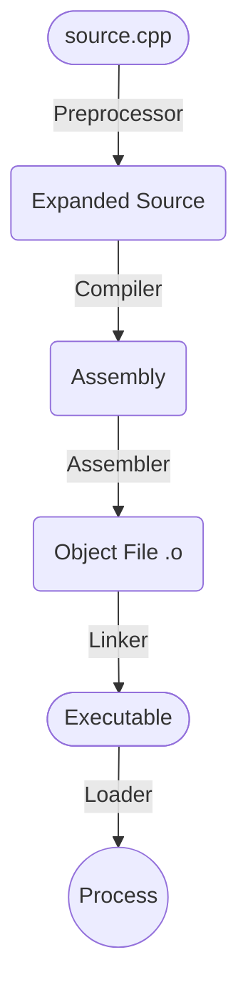
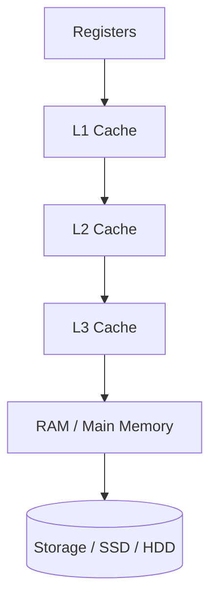
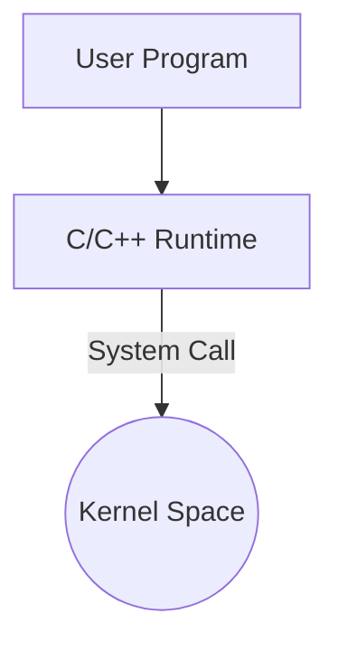
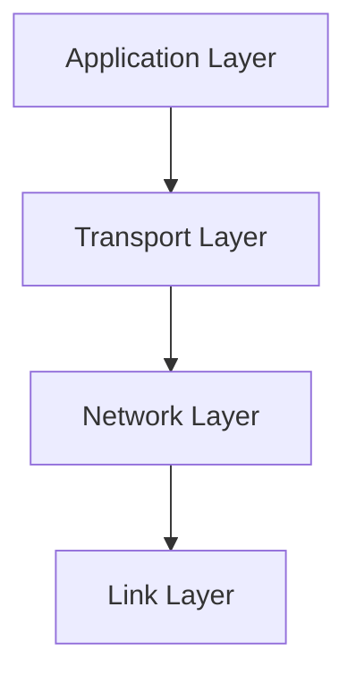
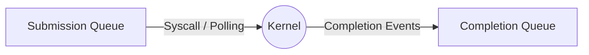
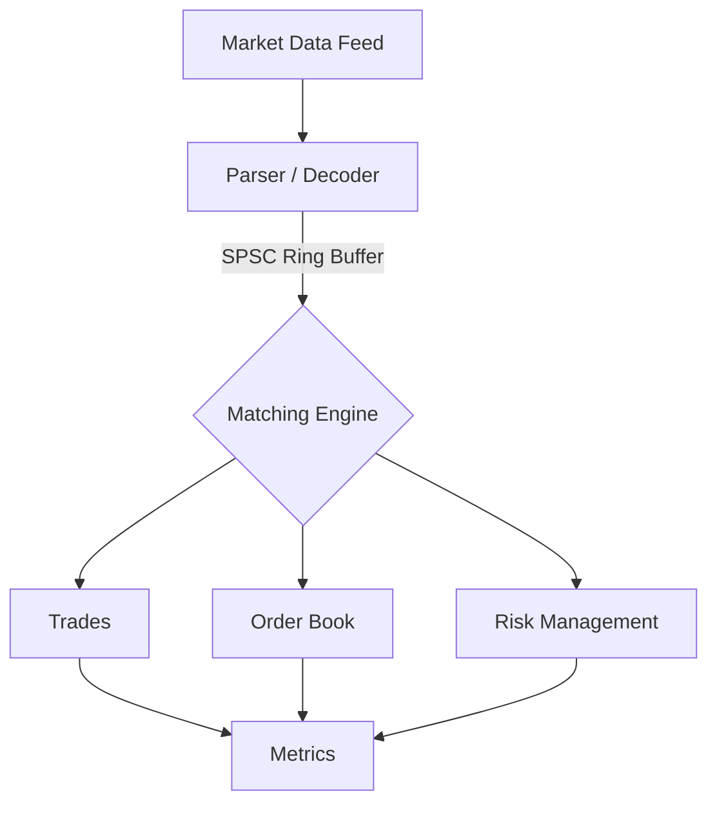
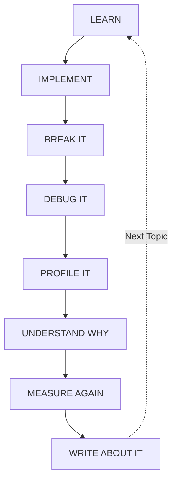

# C++ Systems & Performance Engineering Roadmap

> [!TIP]
> **Goal:** Become exceptionally strong in modern C++, Linux systems, concurrency, performance engineering, networking, and hardware-aware programming.

> [!NOTE]
> **Target profile:** HFT, low-latency systems, high-performance infrastructure, databases, runtimes, compilers, and strong systems/software roles at big tech.

---

# Table of Contents

1. [The Overall Roadmap](#1-the-overall-roadmap)
2. [Phase 0 — Modern C++ Foundation](#2-phase-0--modern-c-foundation)
3. [Phase 1 — What Happens Beneath C++](#3-phase-1--what-happens-beneath-c)
4. [Phase 2 — Memory and Hardware](#4-phase-2--memory-and-hardware)
5. [Phase 3 — Linux Systems Mastery](#5-phase-3--linux-systems-mastery)
6. [Phase 4 — Concurrency](#6-phase-4--concurrency)
7. [Phase 5 — Performance Engineering](#7-phase-5--performance-engineering)
8. [Phase 6 — Networking and I/O](#8-phase-6--networking-and-io)
9. [Phase 7 — Advanced I/O and Kernel Bypass](#9-phase-7--advanced-io-and-kernel-bypass)
10. [Phase 8 — x86-64, Assembly, and SIMD](#10-phase-8--x86-64-assembly-and-simd)
11. [Phase 9 — The Flagship Project](#11-phase-9--the-flagship-project)
12. [What Not to Learn Yet](#12-what-not-to-learn-yet)
13. [Weekly Study Split](#13-weekly-study-split)
14. [Free Resources](#14-free-resources)
15. [Milestones](#15-milestones)
16. [The Learning Loop](#16-the-learning-loop)

---

# 1. The Overall Roadmap

```mermaid
flowchart TD
    P0["**Phase 0**<br/>Write solid modern C++"] --> P1["**Phase 1**<br/>Understand what C++ actually does"]
    P1 --> P2["**Phase 2**<br/>Understand memory and hardware"]
    P2 --> P3["**Phase 3**<br/>Become dangerous with Linux"]
    P3 --> P4["**Phase 4**<br/>Master concurrency and atomics"]
    P4 --> P5["**Phase 5**<br/>Learn performance engineering"]
    P5 --> P6["**Phase 6**<br/>Master networking and event-driven I/O"]
    P6 --> P7["**Phase 7**<br/>Advanced I/O and kernel bypass"]
    P7 --> P8["**Phase 8**<br/>x86-64, assembly, and SIMD"]
    P8 --> P9["**Phase 9**<br/>Build serious high-performance systems"]
    P9 --> P10["**Phase 10**<br/>Read real production code and specialize"]
````

> [!IMPORTANT]
> Do not try to learn all of this simultaneously. Depth matters more than touching everything once.

The goal is not to become someone who knows the most C++ syntax.

The goal is to become someone who can answer:

- What does this code compile into?
    
- Where is this object stored?
    
- Who owns this memory?
    
- What is its lifetime?
    
- How does this affect the cache?
    
- Is this operation thread-safe?
    
- What does the compiler optimize?
    
- Where is the actual bottleneck?
    
- How can I measure it?
    

---

# 2. Phase 0 — Modern C++ Foundation

**Estimated time: 2–4 months**


### 📚 Useful References for Phase 0
- [cppreference: C++ Language](https://en.cppreference.com/w/cpp/language)
- [Learn C++ (Comprehensive tutorials)](https://www.learncpp.com/)
- [Effective Modern C++ by Scott Meyers](https://www.oreilly.com/library/view/effective-modern-c/9781491908419/)

## Core Language

Become comfortable with:

- Pointers and references
    
- Object lifetime
    
- Storage duration
    
- Stack vs heap
    
- `const`
    
- Value categories
    
- Lvalues
    
- Xvalues
    
- Prvalues
    
- Copy semantics
    
- Move semantics
    
- Constructors and destructors
    
- RAII
    
- Exceptions
    
- Templates
    
- Concepts
    
- Lambdas
    
- `constexpr`
    
- `consteval`
    

## Modern Standard Library

Understand these well:

```cpp
std::vector
std::array
std::deque
std::list
std::unordered_map
std::map
std::set
std::unordered_set

std::unique_ptr
std::shared_ptr
std::weak_ptr

std::optional
std::variant
std::any

std::span
std::string_view

std::algorithm
std::ranges

std::chrono
std::filesystem

std::thread
std::mutex
std::atomic
std::condition_variable
```

### Important mindset

Do not simply memorize syntax.

For every feature, ask:

> [!NOTE]
> What does this do at runtime?

For example:

- Does it allocate?
    
- Does it copy?
    
- Does it move?
    
- Does it cause indirection?
    
- What owns the object?
    
- When is the destructor called?
    

## Primary Resources

- [cppreference](https://en.cppreference.com/)
    
- [CppCon](https://www.youtube.com/@CppCon)
    
- [C++ Core Guidelines](https://isocpp.github.io/CppCoreGuidelines/CppCoreGuidelines)
    

Use **cppreference as a reference**, not as something to read from beginning to end.

---

# 3. Phase 1 — What Happens Beneath C++

This phase is where C++ starts becoming much more interesting.


### 📚 Useful References for Phase 1
- [GCC and Make - A Tutorial](https://www3.ntu.edu.sg/home/ehchua/programming/cpp/gcc_make.html)
- [How to Write a Shared Library](https://akkadia.org/drepper/dsohowto.pdf)
- [CMake Tutorial](https://cmake.org/cmake/help/latest/guide/tutorial/index.html)

## Understand the Compilation Pipeline



Learn:

- Translation units
    
- Headers
    
- Include guards
    
- The One Definition Rule
    
- Static libraries
    
- Shared libraries
    
- Name mangling
    
- Symbol resolution
    
- ABI
    
- ELF
    
- Dynamic linking
    
- Static linking
    

## Tools

Learn to use:

```bash
clang++
g++
cmake
ninja

nm
readelf
objdump
ldd
size
strings
```

## Project

Build a small C++ library.

Create:

```text
project/
├── library/
│   ├── include/
│   └── src/
├── app/
├── CMakeLists.txt
└── README.md
```

Build it as:

1. A static library
    
2. A shared library
    
3. An executable using the library
    

Then inspect the output with:

```bash
nm
readelf
objdump
ldd
```

The goal is to understand what actually changed.

---

# 4. Phase 2 — Memory and Hardware

This is one of the highest-ROI phases for high-performance C++.


### 📚 Useful References for Phase 2
- [What Every Programmer Should Know About Memory (Ulrich Drepper)](https://people.freebsd.org/~lstewart/articles/cpumemory.pdf)
- [Data-Oriented Design (Richard Fabian)](https://www.dataorienteddesign.com/dodbook/)

## Learn the Memory Hierarchy



Understand:

- Cache lines
    
- Spatial locality
    
- Temporal locality
    
- Cache misses
    
- Cache coherence
    
- False sharing
    
- Hardware prefetching
    
- TLB
    
- Virtual memory
    
- Page faults
    
- Page tables
    
- Huge pages
    

## Projects

### Project 1 — Array of Structs vs Struct of Arrays

Compare:

```cpp
struct Particle {
    float x;
    float y;
    float z;
    float velocity;
};
```

with a Structure of Arrays approach:

```cpp
struct Particles {
    std::vector<float> x;
    std::vector<float> y;
    std::vector<float> z;
    std::vector<float> velocity;
};
```

Benchmark both.

Explain:

- Memory layout
    
- Cache locality
    
- Why one may perform better
    

---

### Project 2 — Matrix Traversal

Compare row-major traversal:

```cpp
for (int i = 0; i < rows; ++i)
    for (int j = 0; j < cols; ++j)
        sum += matrix[i][j];
```

against column-major traversal.

Measure the difference.

Explain why cache locality changes performance.

---

### Project 3 — False Sharing

Create two threads modifying adjacent counters.

Then compare:

```cpp
struct Counters {
    std::atomic<int> a;
    std::atomic<int> b;
};
```

against cache-line-separated counters.

Measure the impact.

---

# 5. Phase 3 — Linux Systems Mastery

Learn Linux as a programmer, not just as a desktop environment.


### 📚 Useful References for Phase 3
- [The Linux Programming Interface (Michael Kerrisk)](https://man7.org/tlpi/)
- [Beej's Guide to Unix Interprocess Communication](https://beej.us/guide/bgipc/)

## Processes

Understand:

- `fork`
    
- `exec`
    
- `wait`
    
- Process memory layout
    
- File descriptors
    
- Pipes
    
- Signals
    
- Process groups
    

## System Calls

Understand the transition:



Learn to inspect programs using:

```bash
strace
ltrace
```

## File Descriptors

Master the idea that many Linux resources can be represented by file descriptors:

```text
stdin
stdout
stderr

files
sockets
pipes
eventfd
timerfd
epoll
```

## Project — Build a Mini Shell

Create something like:

```text
mysh
```

Support:

```bash
ls
ls | grep cpp
cat file > output.txt
sleep 10 &
```

This teaches:

- `fork`
    
- `exec`
    
- Pipes
    
- File descriptor redirection
    
- Process management
    
- Signals
    

---

# 6. Phase 4 — Concurrency

This is mandatory for your target profile.


### 📚 Useful References for Phase 4
- [C++ Concurrency in Action (Anthony Williams)](https://www.manning.com/books/c-plus-plus-concurrency-in-action-second-edition)
- [C++ memory order (cppreference)](https://en.cppreference.com/w/cpp/atomic/memory_order)

## Level 1 — Basic Threading

Master:

```cpp
std::thread
std::mutex
std::lock_guard
std::unique_lock
std::condition_variable
```

Understand:

- Critical sections
    
- Mutual exclusion
    
- Deadlocks
    
- Lock ordering
    
- Contention
    

## Level 2 — Atomics

Learn:

```cpp
std::atomic
```

Memory orders:

```cpp
std::memory_order_relaxed
std::memory_order_acquire
std::memory_order_release
std::memory_order_acq_rel
std::memory_order_seq_cst
```

## Level 3 — Concurrency Problems

Understand deeply:

- Data races
    
- Race conditions
    
- Deadlocks
    
- Livelock
    
- Starvation
    
- ABA problem
    
- False sharing
    
- Lock contention
    

## Level 4 — Build Things

Implement:

1. Thread pool
    
2. Bounded blocking queue
    
3. SPSC ring buffer
    
4. MPSC queue
    
5. Lock-free stack as a learning exercise
    

> [!WARNING]
> Do not start by building complicated lock-free data structures.

First understand why:

```text
atomics
+
memory ordering
+
cache coherence
+
CPU reordering
```

make concurrent programming difficult.

The real test is:

> [!IMPORTANT]
> Can I explain exactly why this memory ordering is correct?

---

# 7. Phase 5 — Performance Engineering

Many C++ programmers optimize based on intuition.

Do not become one of them.


### 📚 Useful References for Phase 5
- [Systems Performance (Brendan Gregg)](https://www.brendangregg.com/systems-performance.html)
- [Google Benchmark](https://github.com/google/benchmark)

## Learn `perf`

Use it to investigate:

- CPU cycles
    
- Instructions
    
- Cache misses
    
- Branch misses
    
- Context switches
    

Learn:

- Sampling profiling
    
- Flame graphs
    
- Call graphs
    
- Instrumentation
    
- Microbenchmarking
    

## The Performance Workflow

```text
1. Form a hypothesis
        ↓
2. Measure baseline
        ↓
3. Profile
        ↓
4. Identify bottleneck
        ↓
5. Change ONE thing
        ↓
6. Measure again
        ↓
7. Verify improvement
        ↓
8. Explain why
```

Never say:

> [!CAUTION]
> "This should be faster."

Say:

> [!TIP]
> "The benchmark shows this is 18% faster because..."

## Project — Optimization Diary

Take a deliberately inefficient C++ program.

Optimize it over multiple iterations.

For every optimization, document:

```text
Baseline:
X ns/op

Problem:
What was slow?

Evidence:
What did the profiler show?

Change:
What changed?

Result:
Y ns/op

Explanation:
Why did this improve?
```

This is much more impressive than generic projects.

---

# 8. Phase 6 — Networking and I/O

Learn networking fundamentals before touching DPDK.


### 📚 Useful References for Phase 6
- [Beej's Guide to Network Programming](https://beej.us/guide/bgnet/)
- [High Performance Browser Networking (Ilya Grigorik)](https://hpbn.co/)

## TCP/IP

Understand:



## TCP

Learn:

- Three-way handshake
    
- Sequence numbers
    
- ACKs
    
- Flow control
    
- Congestion control
    
- Retransmission
    
- Nagle's algorithm
    
- Head-of-line blocking
    

## UDP

Understand:

- Datagrams
    
- Packet loss
    
- Ordering
    
- Why low-latency systems sometimes use UDP
    

## Linux Sockets

Master:

```cpp
socket()
bind()
listen()
accept()
connect()
send()
recv()
```

Then learn:

```text
select
poll
epoll
```

## Project — Event-Driven TCP Server

Requirements:

- Non-blocking sockets
    
- `epoll`
    
- Multiple simultaneous clients
    
- Connection state machine
    
- Graceful disconnection
    
- Benchmarking
    

Then profile it.

---

# 9. Phase 7 — Advanced I/O and Kernel Bypass

Only start this after understanding regular Linux networking and I/O.


### 📚 Useful References for Phase 7
- [Lord of the io_uring (Axboe)](https://unixism.net/loti/)
- [DPDK Documentation](https://doc.dpdk.org/guides/)
- [Cloudflare: io_uring blog](https://blog.cloudflare.com/io_uring-fast-kernel-bypass/)

## `io_uring`

Understand:



Learn:

- Asynchronous I/O
    
- Submission queues
    
- Completion queues
    
- Registered buffers
    
- Registered files
    

Do not treat `io_uring` as magic.

Understand what problem it is solving.

## DPDK

Only after:

- Networking fundamentals
    
- Linux networking
    
- Concurrency
    
- Memory
    
- Performance
    

Learn DPDK concepts:

- Memory pools
    
- Packet buffers
    
- Ring buffers
    
- Poll-mode drivers
    
- Huge pages
    
- NUMA awareness
    

### Important

Your current hardware does not need to be perfect.

You can still:

- Compile DPDK
    
- Read its source
    
- Understand its architecture
    
- Experiment with what your hardware supports
    

Do not buy expensive networking hardware before you know why you need it.

---

# 10. Phase 8 — x86-64, Assembly, and SIMD

This is particularly valuable for HFT and low-latency work.


### 📚 Useful References for Phase 8
- [Intel 64 and IA-32 Architectures Software Developer Manuals](https://software.intel.com/content/www/us/en/develop/articles/intel-sdm.html)
- [Compiler Explorer (Godbolt)](https://godbolt.org/)

## Learn x86-64 Fundamentals

Understand:

- Registers
    
- Calling conventions
    
- Stack frames
    
- Function calls
    
- Instruction latency
    
- Instruction throughput
    
- Branch prediction
    

Study instructions such as:

```text
mov
lea
cmp
test
jmp
call
ret

add
sub
imul
```

Understand:

```text
lock-prefixed instructions
```

Then SIMD:

```text
SSE
AVX
AVX2
AVX-512
```

## Important

The goal is **not** to write everything in assembly.

The goal is:

> [!TIP]
> Look at compiler-generated assembly and understand what your C++ is actually doing.

Use:

- Compiler Explorer
    
- `objdump`
    
- `perf`
    

## Project — SIMD Dot Product

Implement:

1. Naive scalar implementation
    
2. Optimized scalar implementation
    
3. Auto-vectorized implementation
    
4. Explicit SIMD implementation
    

Benchmark everything.

Document:

```text
Scalar:
X

Auto-vectorized:
Y

Explicit SIMD:
Z
```

Explain the generated assembly.

---

# 11. Phase 9 — The Flagship Project


### 📚 Useful References for Phase 9
- [Building a High-Performance Matching Engine](https://weareadaptive.com/2021/08/23/build-high-performance-matching-engine/)
- [LMAX Architecture (Martin Fowler)](https://martinfowler.com/articles/lmax.html)

## Build a Low-Latency Exchange Simulator

Architecture:



## Matching Engine

Implement:

- Limit orders
    
- Market orders
    
- Cancel orders
    
- Modify orders
    
- Price-time priority
    

## Performance Requirements

Investigate:

- Dynamic allocations
    
- Object pools
    
- Data-oriented design
    
- Cache locality
    
- SPSC queues
    
- CPU affinity
    
- Thread placement
    
- Latency histograms
    

Measure:

```text
Throughput
p50 latency
p99 latency
p99.9 latency
Maximum latency
```

## Project Evolution

### Version 1

Basic single-threaded matching engine.

### Version 2

Multithreaded architecture.

### Version 3

SPSC queues.

### Version 4

Networked market data feed.

### Version 5

Binary protocol.

### Version 6

`epoll`.

### Version 7

Advanced asynchronous I/O.

### Version 8

Kernel-bypass experiments.

This one project can evolve over multiple years.

---

# 12. What Not to Learn Yet

This section is important.

## Do Not Memorize Every C++ Feature

You do not need to master:

- Every obscure template trick
    
- Every Boost library
    
- Every new C++ standard feature immediately
    
- Template metaprogramming puzzles for the sake of puzzles
    

Understand deeply instead.

---

## Do Not Learn Design Patterns as a Checklist

Avoid:

```text
Factory ✓
Singleton ✓
Observer ✓
Visitor ✓
Abstract Factory ✓
```

That is not software engineering mastery.

Understand:

- Why an abstraction exists
    
- What problem it solves
    
- Its runtime cost
    
- When not to use it
    

---

## Do Not Overuse OOP

Understand that:

```cpp
virtual_function();
```

may involve:

- Indirection
    
- Reduced locality
    
- Difficult optimization
    

This does **not** mean OOP is bad.

It means:

> [!TIP]
> Choose abstractions based on the problem.

---

## Do Not Start With Lock-Free Programming

Do not immediately attempt:

> "I'm going to write the world's fastest lock-free exchange."

First master:

```text
mutexes
atomics
memory ordering
cache coherence
false sharing
contention
```

---

## Do Not Spend All Your Time on LeetCode

Algorithms are extremely important.

But:

```text
1000 LeetCode problems
+
No systems knowledge
+
No serious projects
```

is not the profile this roadmap is building.

Maintain strong DSA skills while building depth elsewhere.

---

# 13. Weekly Study Split

A good approximate split:

## 35% — C++ + Systems Projects

Actual implementation.

Build things.

## 25% — DSA / Competitive Programming

Maintain algorithmic strength.

## 20% — Systems Theory

Study:

- Operating systems
    
- Networking
    
- Computer architecture
    
- Concurrency
    

## 15% — Performance Engineering

- Benchmarking
    
- Profiling
    
- Assembly
    
- Cache analysis
    

## 5% — Reading Excellent Code

Read projects such as:

- Linux kernel components
    
- High-performance libraries
    
- Databases
    
- Networking libraries
    
- Compilers
    

Do not try to understand an entire massive codebase at once.

Pick one small subsystem.

---

# 14. Free Resources

## C++ Reference

### cppreference

[https://en.cppreference.com/](https://en.cppreference.com/)

Use this as your permanent C++ reference.

---

## CppCon

[https://www.youtube.com/@CppCon](https://www.youtube.com/@CppCon)

Useful speakers and topics include:

- Chandler Carruth
    
- Andrei Alexandrescu
    
- Herb Sutter
    
- Jason Turner
    
- Timur Doumler
    
- Fedor Pikus
    

Do not watch talks randomly.

Search for talks relevant to what you are currently learning.

---

## C++ Core Guidelines

[https://isocpp.github.io/CppCoreGuidelines/CppCoreGuidelines](https://isocpp.github.io/CppCoreGuidelines/CppCoreGuidelines)

---

## Compiler Explorer

[https://godbolt.org/](https://godbolt.org/)

Use it to answer:

> What assembly did my C++ produce?

---

## Linux Kernel Documentation

[https://docs.kernel.org/](https://docs.kernel.org/)

---

## DPDK Documentation

[https://doc.dpdk.org/guides/](https://doc.dpdk.org/guides/)

---

# 15. Milestones

## After 6 Months

You should comfortably be able to:

- Write modern C++
    
- Understand RAII and object lifetime
    
- Use CMake
    
- Debug with GDB
    
- Understand compilation and linking
    
- Understand basic OS concepts
    
- Write multithreaded programs
    
- Solve reasonably difficult DSA problems
    

---

## After 1 Year

You should be able to:

- Use `perf`
    
- Understand atomics
    
- Understand cache behavior
    
- Write event-driven network servers
    
- Inspect generated assembly
    
- Build concurrent systems
    
- Have 2–3 genuinely strong projects
    

---

## After 2 Years

You should be able to:

> Take a C++ system, profile it, identify the actual bottleneck, explain the hardware/software reason, and make a measurable improvement.

This is a very valuable engineering skill.

---

## After 3–4 Years

The goal profile:

```text
Strong Algorithms
        +
Modern C++
        +
Linux
        +
Concurrency
        +
Performance Engineering
        +
Networking
        +
x86 / SIMD
        +
Serious Systems Projects
```

This combination can make you unusually competitive for:

- HFT
    
- Low-latency systems
    
- Trading infrastructure
    
- High-performance backend systems
    
- Databases
    
- Infrastructure engineering
    
- Systems roles at large tech companies
    

---

# 16. The Learning Loop

This is the most important rule in the entire roadmap.

For every major topic:



Do not endlessly consume tutorials.

Build things.

Break things.

Measure things.

For every project, your README should ideally answer:

1. What problem does this solve?
    
2. What is the architecture?
    
3. What tradeoffs did you make?
    
4. How did you measure performance?
    
5. What bottleneck did you find?
    
6. What optimization did you make?
    
7. Why did it work?
    
8. What would you improve next?
    

---

# Final Goal

Do not aim to become:

> Someone who knows a lot of C++ syntax.

Aim to become:

> [!SUCCESS]
> **Someone who can understand a system from the C++ source code down through assembly, CPU behavior, memory, Linux, networking, and performance measurements.**

That is the kind of depth that can make you genuinely exceptional over your university years.

The roadmap is long. That is intentional.

You do not need to rush through it.

Go deep, build continuously, benchmark everything, and keep your best work documented publicly.
